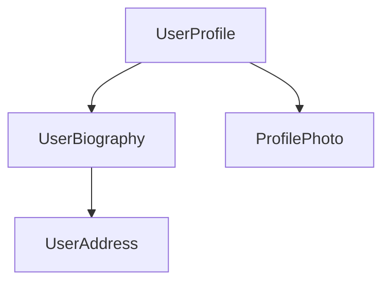
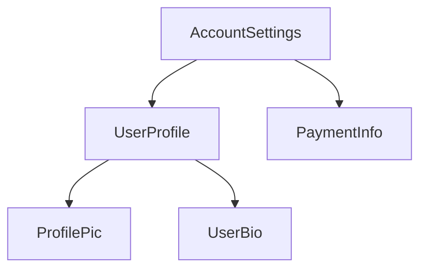
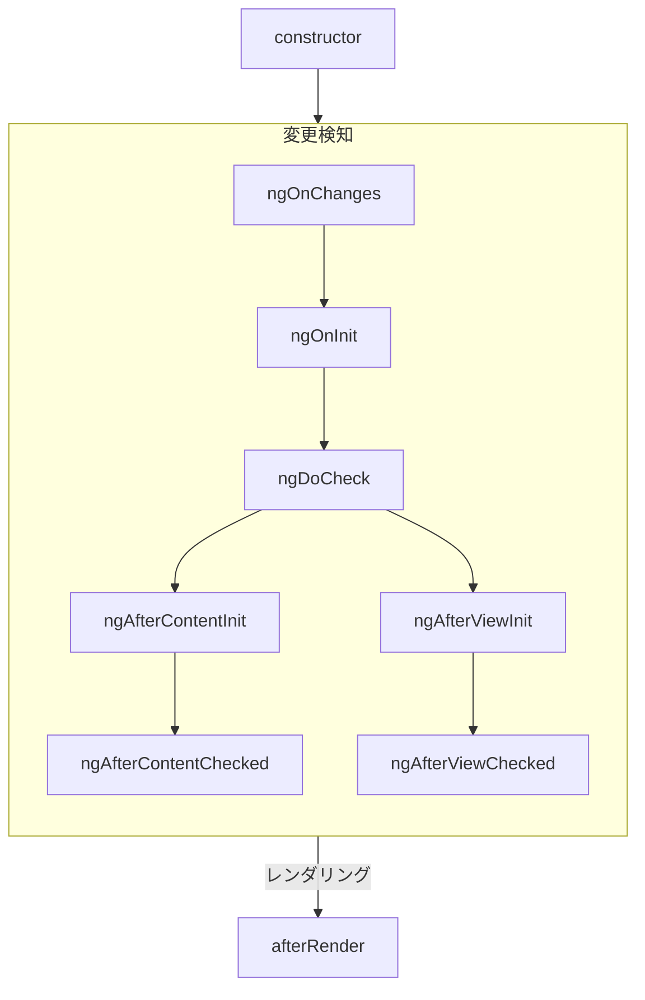
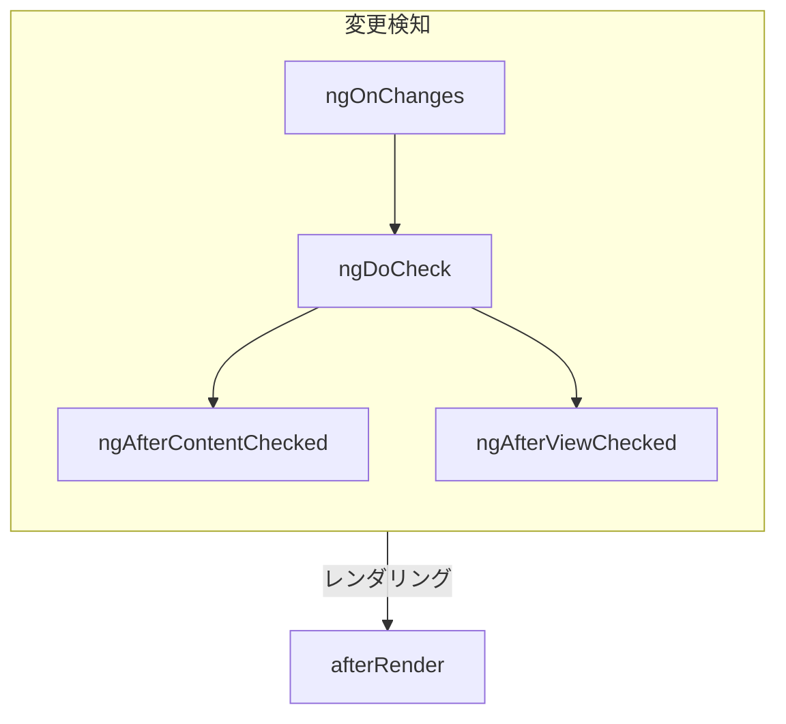

<docs-decorative-header title="コンポーネント" imgSrc="adev/src/assets/images/components.svg"> <!-- markdownlint-disable-line -->
Angular アプリケーションを作成するための基本的な構成要素
</docs-decorative-header>

コンポーネントは、Angular アプリケーションの主要な構成要素です。各コンポーネントは、より大きなウェブページの一部を表します。アプリケーションをコンポーネントに整理することで、プロジェクトに構造が与えられ、コードが特定の部分に明確に分割されるため、保守と拡張が容易になります。

## コンポーネントの定義

すべてのコンポーネントには、いくつかの主要な部分があります。

1. Angular によって使用されるいくつかの設定を含む`@Component`[デコレーター](https://www.typescriptlang.org/docs/handbook/decorators.html)。
2. DOM にレンダリングされる内容を制御する HTML テンプレート。
3. HTML でコンポーネントがどのように使用されるかを定義する[CSS セレクター](https://developer.mozilla.org/docs/Learn/CSS/Building_blocks/Selectors)。
4. ユーザー入力の処理やサーバーへのリクエストの実行など、動作を定義する TypeScript クラス。

`UserProfile`コンポーネントの簡略化された例を以下に示します。

```angular-ts
// user-profile.ts
@Component({
  selector: 'user-profile',
  template: `
    <h1>User profile</h1>
    <p>This is the user profile page</p>
  `,
})
export class UserProfile { /* Your component code goes here */ }
```

`@Component`デコレーターは、テンプレートに適用する CSS を指定するために、オプションで`styles`プロパティも受け付けます。

```angular-ts
// user-profile.ts
@Component({
  selector: 'user-profile',
  template: `
    <h1>User profile</h1>
    <p>This is the user profile page</p>
  `,
  styles: `h1 { font-size: 3em; } `,
})
export class UserProfile { /* Your component code goes here */ }
```

### HTML と CSS を別々のファイルに分離する

`templateUrl`と`styleUrl`を使用して、コンポーネントの HTML と CSS を別々のファイルで定義できます。

```angular-ts
// user-profile.ts
@Component({
  selector: 'user-profile',
  templateUrl: 'user-profile.html',
  styleUrl: 'user-profile.css',
})
export class UserProfile {
  // コンポーネントの動作はここに定義されます
}
```

```angular-html
<!-- user-profile.html -->
<h1>Use profile</h1>
<p>This is the user profile page</p>
```

```css
/* user-profile.css */
h1 {
  font-size: 3em;
}
```

## コンポーネントの使用

アプリケーションは複数のコンポーネントを組み合わせて構築します。例えば、ユーザーのプロファイルページを作成する場合、次のようにページをいくつかのコンポーネントに分割できます。



ここで、`UserProfile`コンポーネントは他のいくつかのコンポーネントを使用して最終的なページを作成します。

コンポーネントをインポートして使用するには、次の手順が必要です。

1. コンポーネントの TypeScript ファイルに、使用するコンポーネントの`import`文を追加します。
2. `@Component`デコレーターの`imports`配列に、使用するコンポーネントのエントリを追加します。
3. コンポーネントのテンプレートに、使用するコンポーネントのセレクターと一致する要素を追加します。

`ProfilePhoto`コンポーネントをインポートする`UserProfile`コンポーネントの例を次に示します。

```angular-ts
// user-profile.ts
import {ProfilePhoto} from 'profile-photo.ts';

@Component({
  selector: 'user-profile',
  imports: [ProfilePhoto],
  template: `
    <h1>User profile</h1>
    <profile-photo />
    <p>This is the user profile page</p>
  `,
})
export class UserProfile {
  // コンポーネントの動作はここに定義されます
}
```

Tip: Angular コンポーネントの詳細については、[詳細なコンポーネントガイド](guide/components)を参照してください。

## 次の手順

Angular でのコンポーネントの動作が分かったところで、アプリケーションに動的なデータをどのように追加して管理するかを学ぶ時です。

<docs-pill-row>
  <docs-pill title="シグナルによるリアクティビティ" href="essentials/signals" />
  <docs-pill title="詳細なコンポーネントガイド" href="guide/components" />
</docs-pill-row>

<docs-decorative-header title="コンポーネントの構造" imgSrc="adev/src/assets/images/components.svg"> <!-- markdownlint-disable-line -->
</docs-decorative-header>

Tip: このガイドでは、すでに[基本概念のガイド](essentials)を読んでいることを前提としています。Angular を初めて使う場合は、まずそちらをお読みください。

すべてのコンポーネントには次のものが必要です。

- ユーザー入力の処理やサーバーからのデータ取得などの*動作*を定義する TypeScript クラス
- DOM にレンダリングされる内容を制御する HTML テンプレート
- HTML でコンポーネントがどのように使用されるかを定義する[CSS セレクター](https://developer.mozilla.org/docs/Learn/CSS/Building_blocks/Selectors)

TypeScript クラスの上部に `@Component` [デコレーター](https://www.typescriptlang.org/docs/handbook/decorators.html) を追加することで、コンポーネントに Angular 固有の情報を与えます。

<docs-code language="angular-ts" highlight="[1, 2, 3, 4]">
@Component({
  selector: 'profile-photo',
  template: ``,
})
export class ProfilePhoto { }
</docs-code>

データバインディング、イベント処理、制御フローなど、Angular テンプレート作成に関する詳細は、[テンプレートガイド](guide/templates)を参照してください。

`@Component` デコレーターに渡されるオブジェクトは、コンポーネントの**メタデータ**と呼ばれます。これには、このガイドで説明されている `selector`、`template`、その他のプロパティが含まれています。

コンポーネントには、オプションでそのコンポーネントの DOM に適用される CSS スタイルのリストを含めることができます。

<docs-code language="angular-ts" highlight="[4]">
@Component({
  selector: 'profile-photo',
  template: ``,
  styles: `img { border-radius: 50%; }`,
})
export class ProfilePhoto { }
</docs-code>

デフォルトでは、コンポーネントのスタイルは、そのコンポーネントのテンプレートで定義された要素にのみ影響を与えます。Angular のスタイリングアプローチの詳細については、[コンポーネントのスタイリング](guide/components/styling)を参照してください。

テンプレートとスタイルを別々のファイルにも記述できます。

<docs-code language="angular-ts" highlight="[3, 4]">
@Component({
  selector: 'profile-photo',
  templateUrl: 'profile-photo.html',
  styleUrl: 'profile-photo.css',
})
export class ProfilePhoto { }
</docs-code>

これにより、プロジェクト内の*表示*と*動作*の懸念事項を分離できます。プロジェクト全体に対して 1 つのアプローチを選択するか、コンポーネントごとにどちらを使用するかを決定できます。

`templateUrl`と`styleUrl`の両方は、コンポーネントが存在するディレクトリを基準とした相対パスです。

## コンポーネントの使用

### `@Component`デコレーターでのインポート

コンポーネント、[ディレクティブ](guide/directives)、または[パイプ](guide/templates/pipes)を使用するには、
`@Component`デコレーターの`imports`配列に追加する必要があります。

```angular-ts
import {ProfilePhoto} from './profile-photo';

@Component({
  // このコンポーネントのテンプレートで使用するために、
  // `ProfilePhoto`コンポーネントをインポートします。
  imports: [ProfilePhoto],
  /* ... */
})
export class UserProfile { }
```

デフォルトでは、Angular コンポーネントは*スタンドアロン*です。つまり、他のコンポーネントの`imports`配列に直接追加できます。以前のバージョンの Angular で作成されたコンポーネントは、代わりに`@Component`デコレーターで`standalone: false`を指定している場合があります。これらのコンポーネントの場合、代わりにコンポーネントが定義されている`NgModule`をインポートします。詳細は、完全な[`NgModule`ガイド](guide/ngmodules)を参照してください。

IMPORTANT: 19.0.0 より前の Angular バージョンでは、`standalone`オプションはデフォルトで`false`です。

### テンプレートでのコンポーネントの表示

すべてのコンポーネントは[CSS セレクター](https://developer.mozilla.org/docs/Learn/CSS/Building_blocks/Selectors)を定義します。

<docs-code language="angular-ts" highlight="[2]">
@Component({
  selector: 'profile-photo',
  ...
})
export class ProfilePhoto { }
</docs-code>

Angular がサポートするセレクターの種類と、セレクターの選択に関するガイダンスについては、[コンポーネントセレクター](guide/components/selectors)を参照してください。

*他の*コンポーネントのテンプレートで一致する HTML 要素を作成することで、コンポーネントを表示します。

<docs-code language="angular-ts" highlight="[8]">
@Component({
  selector: 'profile-photo',
})
export class ProfilePhoto { }

@Component({
imports: [ProfilePhoto],
template: `<profile-photo />`
})
export class UserProfile { }
</docs-code>

Angular は、遭遇する一致する HTML 要素ごとにコンポーネントのインスタンスを作成します。コンポーネントのセレクターと一致する DOM 要素は、そのコンポーネントの**ホスト要素**と呼ばれます。コンポーネントのテンプレートの内容はそのホスト要素内にレンダリングされます。

コンポーネントによってレンダリングされる DOM（コンポーネントのテンプレートに対応）は、
そのコンポーネントの**ビュー**と呼ばれます。

このようにコンポーネントを構成することで、**Angular アプリケーションをコンポーネントのツリーと考えることができます**。



このツリー構造は、[依存性の注入](guide/di)や[子クエリ](guide/components/queries)など、他のいくつかの Angular の概念を理解する上で重要です。

# コンポーネントセレクター

Tip: このガイドは、[基本概念のガイド](essentials) を既にお読みになっていることを前提としています。Angular を初めて使用する場合は、まずこちらをお読みください。

各コンポーネントは、
コンポーネントの使用方法を決定する
[CSS セレクター](https://developer.mozilla.org/docs/Web/CSS/CSS_Selectors) を定義します。

<docs-code language="angular-ts" highlight="[2]">
@Component({
  selector: 'profile-photo',
  ...
})
export class ProfilePhoto { }
</docs-code>

コンポーネントを使用するには、*他の*コンポーネントのテンプレートに一致する HTML 要素を作成します。

<docs-code language="angular-ts" highlight="[3]">
@Component({
  template: `
    <profile-photo />
    <button>Upload a new profile photo</button>`,
  ...,
})
export class UserProfile { }
</docs-code>

**Angular はコンパイル時にセレクターを静的にマッチングします。**
Angular バインディングや DOM API を介して実行時に DOM を変更しても、レンダリングされるコンポーネントには影響しません。

**1 つの要素は、1 つのコンポーネントセレクターにのみマッチングできます。**
複数のコンポーネント セレクターが 1 つの要素にマッチングする場合、Angular はエラーを報告します。

**コンポーネント セレクターは大文字と小文字を区別します。**

## セレクターの種類

Angular は、コンポーネントセレクターで
[基本的な CSS セレクターの種類](https://developer.mozilla.org/docs/Web/CSS/CSS_Selectors)
の一部をサポートしています。

| **セレクターの種類** | **説明**                                                                                  | **例**                        |
| -------------------- | ----------------------------------------------------------------------------------------- | ----------------------------- |
| タイプセレクター     | HTML タグ名またはノード名に基づいて要素をマッチングします。                               | `profile-photo`               |
| 属性セレクター       | HTML 属性の存在に基づいて要素をマッチングし、オプションでその属性の正確な値を指定します。 | `[dropzone]` `[type="reset"]` |
| クラスセレクター     | CSS クラスの存在に基づいて要素をマッチングします。                                        | `.menu-item`                  |

属性値の場合、Angular は等号 (`=`) 演算子を使用して、正確な属性値をマッチングすることをサポートしています。
Angular は他の属性値の演算子をサポートしていません。

Angular コンポーネントセレクターは、
[子孫結合子](https://developer.mozilla.org/docs/Web/CSS/Descendant_combinator) や
[子結合子](https://developer.mozilla.org/docs/Web/CSS/Child_combinator) を含む結合子をサポートしていません。

Angular コンポーネントセレクターは、
[名前空間](https://developer.mozilla.org/docs/Web/SVG/Namespaces_Crash_Course) を指定することをサポートしていません。

### `:not` 擬似クラス

Angular は [`:not` 擬似クラス](https://developer.mozilla.org/docs/Web/CSS/:not) をサポートしています。
他のセレクターにこの擬似クラスを追加することで、コンポーネントのセレクターがマッチングする要素を絞り込むことができます。
たとえば、`[dropzone]` 属性セレクターを定義して、
`textarea` 要素のマッチングを防ぐことができます。

<docs-code language="angular-ts" highlight="[2]">
@Component({
  selector: '[dropzone]:not(textarea)',
  ...
})
export class DropZone { }
</docs-code>

Angular は、コンポーネント セレクターで他の擬似クラスまたは擬似要素をサポートしていません。

### セレクターの組み合わせ

複数のセレクターを連結することで、組み合わせられます。
たとえば、`type="reset"` を指定した `<button>` 要素をマッチングできます。

<docs-code language="angular-ts" highlight="[2]">
@Component({
  selector: 'button[type="reset"]',
  ...
})
export class ResetButton { }
</docs-code>

カンマ区切りのリストで、複数のセレクターを定義できます。

<docs-code language="angular-ts" highlight="[2]">
@Component({
  selector: 'drop-zone, [dropzone]',
  ...
})
export class DropZone { }
</docs-code>

Angular は、リスト内の*いずれか*のセレクターにマッチングする要素ごとにコンポーネントを作成します。

## セレクターの選択

ほとんどのコンポーネントは、カスタム要素名をセレクターとして使用する必要があります。
すべてのカスタム要素名は、
[HTML 仕様](https://html.spec.whatwg.org/multipage/custom-elements.html#valid-custom-element-name) に従ってハイフンを含める必要があります。
デフォルトでは、Angular は、使用可能なコンポーネントと一致しないカスタムタグ名に出会うとエラーを報告し、
誤ったコンポーネント名によるバグを防ぎます。

Angular テンプレートで
[ネイティブ カスタム要素](https://developer.mozilla.org/docs/Web/Web_Components) を使用する方法の詳細については、
[コンポーネントの高度な設定](guide/components/advanced-configuration) を参照してください。

### セレクターのプレフィックス

Angular チームは、プロジェクト内で定義されているすべてのカスタムコンポーネントに
短い一貫性のあるプレフィックスを使用することをお勧めします。
たとえば、Angular で YouTube を構築する場合、コンポーネントに `yt-` プレフィックスを付け、`yt-menu`、`yt-player` などのコンポーネントを作成できます。
このようにセレクターに名前空間を付けると、特定のコンポーネントの出所がすぐにわかります。
デフォルトでは、Angular CLI は `app-` を使用します。

Angular は、独自のフレームワーク API に対して `ng` セレクタープレフィックスを使用します。
独自の カスタム コンポーネントのセレクター プレフィックスとして `ng` を使用しないでください。

### 属性セレクターを使用する場合

標準のネイティブ要素にコンポーネントを作成する場合は、属性セレクターを検討する必要があります。
たとえば、カスタムボタンコンポーネントを作成する場合、
属性セレクターを使用して、標準の `<button>` 要素を活用できます。

<docs-code language="angular-ts" highlight="[2]">
@Component({
  selector: 'button[yt-upload]',
   ...
})
export class YouTubeUploadButton { }
</docs-code>

この方法により、コンポーネントの利用者は、追加の作業なしで要素のすべての標準 API を直接使用できます。
これは、`aria-label` などの ARIA 属性に特に役立ちます。

Angular は、使用可能なコンポーネントと一致しないカスタム属性に出会ってもエラーを報告しません。
属性セレクターを使用してコンポーネントを使用する場合、
利用者はコンポーネントまたはその NgModule をインポートし忘れることがあり、その結果、コンポーネントがレンダリングされません。
詳細については、[コンポーネントのインポートと使用](guide/components/importing) を参照してください。

属性セレクターを定義するコンポーネントは、小文字、ダッシュ区切りの属性を使用する必要があります。
上記で説明したプレフィックスの推奨事項に従うことができます。

# コンポーネントのスタイリング

Tip: このガイドでは、すでに[基本概念のガイド](essentials)を読んでいることを前提としています。Angular を初めて使用する場合は、まずそちらをお読みください。

コンポーネントには、そのコンポーネントの DOM に適用される CSS スタイルを含めることができます。

<docs-code language="angular-ts" highlight="[4]">
@Component({
  selector: 'profile-photo',
  template: ``,
  styles: ` img { border-radius: 50%; } `,
})
export class ProfilePhoto { }
</docs-code>

また、別のファイルにスタイルを記述できます。

<docs-code language="angular-ts" highlight="[4]">
@Component({
  selector: 'profile-photo',
  templateUrl: 'profile-photo.html',
  styleUrl: 'profile-photo.css',
})
export class ProfilePhoto { }
</docs-code>

Angular がコンポーネントをコンパイルすると、これらのスタイルはコンポーネントの JavaScript 出力と共に発行されます。
つまり、コンポーネントのスタイルは JavaScript モジュールシステムに参加します。
Angular コンポーネントをレンダリングすると、フレームワークはコンポーネントの関連するスタイルを自動的に含めます。
これは、コンポーネントを遅延読み込みする場合でも同様です。

Angular は、[Sass](https://sass-lang.com)、
[less](https://lesscss.org)、[stylus](https://stylus-lang.com)など、
CSS を出力するすべてのツールと連携します。

## スタイルのスコープ

各コンポーネントには、**ビューカプセル化**設定があり、フレームワークがコンポーネントのスタイルをどのようにスコープするかを決定します。
ビューカプセル化モードには、`Emulated`、`ShadowDom`、`None`の 3 つのモードがあります。
モードは、`@Component`デコレーターで指定できます。

<docs-code language="angular-ts" highlight="[3]">
@Component({
  ...,
  encapsulation: ViewEncapsulation.None,
})
export class ProfilePhoto { }
</docs-code>

### ViewEncapsulation.Emulated

デフォルトでは、Angular はエミュレートされたカプセル化を使用するため、
コンポーネントのスタイルは、そのコンポーネントのテンプレートで定義された要素にのみ適用されます。
このモードでは、フレームワークは各コンポーネントインスタンスに対して一意の HTML 属性を生成し、
その属性をコンポーネントのテンプレート内の要素に追加し、その属性をコンポーネントのスタイルで定義された CSS セレクターに挿入します。

このモードにより、コンポーネントのスタイルが外部に漏れて他のコンポーネントに影響を与えることがなくなります。
ただし、コンポーネントの外側に定義されたグローバルスタイルは、
エミュレートされたカプセル化を持つコンポーネント内の要素に影響を与える可能性があります。

エミュレートされたモードでは、Angular は
[`:host`](https://developer.mozilla.org/docs/Web/CSS/:host)
および[`:host-context()`](https://developer.mozilla.org/docs/Web/CSS/:host-context)擬似
クラスを、
[Shadow DOM](https://developer.mozilla.org/docs/Web/Web_Components/Using_shadow_DOM)
を使用せずにサポートします。
コンパイル時に、フレームワークはこれらの擬似クラスを属性に変換するため、実行時にこれらのネイティブ擬似クラスのルール(ブラウザの互換性、特異性など)に準拠しません。
Angular のエミュレートされたカプセル化モードは、
`::shadow`や`::part`など、Shadow DOM に関連するその他の擬似クラスをサポートしていません。

#### `::ng-deep`

Angular のエミュレートされたカプセル化モードは、カスタム擬似クラス`::ng-deep`をサポートしています。
この擬似クラスを CSS ルールに適用すると、そのルールのカプセル化が無効になり、実質的にグローバルスタイルになります。
**Angular チームは、`::ng-deep`の新しい使用を強くお勧めしません。**
これらの API は、下位互換性のためにのみ残っています。

### ViewEncapsulation.ShadowDom

このモードは、
[Web 標準の Shadow DOM API](https://developer.mozilla.org/docs/Web/Web_Components/Using_shadow_DOM)
を使用して、コンポーネント内のスタイルをスコープします。
このモードを有効にすると、Angular はコンポーネントのホスト要素にシャドウルートを添付し、コンポーネントのテンプレートとスタイルを対応するシャドウツリーにレンダリングします。

このモードでは、*コンポーネントのスタイルのみ*がコンポーネントのテンプレート内の要素に適用されることが厳密に保証されます。
グローバルスタイルはシャドウツリー内の要素に影響を与えることができず、
シャドウツリー内のスタイルはシャドウツリー外の要素に影響を与えることができません。

ただし、`ShadowDom`カプセル化を有効にすると、スタイルのスコープ以外にも影響があります。
シャドウツリーにコンポーネントをレンダリングすると、イベントの伝播、
[`<slot>` API](https://developer.mozilla.org/docs/Web/Web_Components/Using_templates_and_slots)
とのやり取り、ブラウザの開発者ツールによる要素の表示方法に影響を与えます。
このオプションを有効にする前に、アプリケーションで Shadow DOM を使用することのすべての影響を理解してください。

### ViewEncapsulation.None

このモードは、コンポーネントのすべてのスタイルカプセル化を無効にします。
コンポーネントに関連付けられたすべてのスタイルはグローバルスタイルとして動作します。

## テンプレートでのスタイルの定義

コンポーネントのテンプレートで`<style>`要素を使用すると、追加のスタイルを定義できます。
コンポーネントのビューカプセル化モードはこのように定義されたスタイルに適用されます。

Angular は、スタイル要素内のバインディングをサポートしていません。

## 外部スタイルファイルの参照

コンポーネントのテンプレートは、
[`<link>`要素](https://developer.mozilla.org/docs/Web/HTML/Element/link)
を使用して CSS ファイルを参照できます。さらに、CSS は
[ `@import` at-rule](https://developer.mozilla.org/docs/Web/CSS/@import)
を使用して CSS ファイルを参照できます。
Angular はこれらの参照を*外部*スタイルとして扱います。外部スタイルは、エミュレートされたビューカプセル化の影響を受けません。

# 入力プロパティによるデータの受け取り

Tip: このガイドは、既に[基本概念ガイド](essentials)を読んでいることを前提としています。Angular を初めて使用する場合は、まずそちらをお読みください。

Tip: 他のウェブフレームワークに精通している場合は、入力プロパティは*props*に似ています。

コンポーネントを使用する際に、一般的にいくつかのデータを渡したいことがあります。
コンポーネントは、**入力**を宣言することで、受け入れるデータを指定します。

<docs-code language="ts" highlight="[7]">
import {Component, input} from '@angular/core';

@Component({/_..._/})
export class CustomSlider {
// Declare an input named 'value' with a default value of zero.
value = input(0);
}
</docs-code>

これにより、テンプレートのプロパティにバインドできます。

```angular-html
<custom-slider [value]="50" />
```

入力にデフォルト値がある場合、TypeScript はデフォルト値から型を推論します。

```typescript
@Component({
  /*...*/
})
export class CustomSlider {
  // TypeScriptは、この入力が数値であると推論し、InputSignal<number>を返します。
  value = input(0);
}
```

関数のジェネリックパラメーターを指定することで、入力の型を明示的に宣言できます。

デフォルト値のない入力が設定されていない場合、その値は`undefined`になります。

```typescript
@Component({
  /*...*/
})
export class CustomSlider {
  // `value`は設定されない可能性があるため、InputSignal<number | undefined>を生成します。
  value = input<number>();
}
```

**Angular はコンパイル時に静的に入力を記録します。**実行時に入力の追加や削除はできません。

`input`関数は、Angular コンパイラにとって特別な意味を持ちます。**`input`は、コンポーネントとディレクティブのプロパティ初期化子でのみ呼び出すことができます。**

コンポーネントクラスを拡張する場合、**入力は子クラスによって継承されます。**

**入力名は大文字と小文字が区別されます。**

## 入力の読み取り

`input`関数は`InputSignal`を返します。シグナルを呼び出すことで値を読み取ることができます。

<docs-code language="ts" highlight="[5]">
import {Component, input} from '@angular/core';

@Component({/_..._/})
export class CustomSlider {
// Declare an input named 'value' with a default value of zero.
value = input(0);

// Create a computed expression that reads the value input
label = computed(() => `The slider's value is ${this.value()}`);
}
</docs-code>

`input`関数によって作成されたシグナルは読み取り専用です。

## 必須入力

`input`の代わりに`input.required`を呼び出すことで、入力が`required`であることを宣言できます。

<docs-code language="ts" highlight="[3]">
@Component({/*...*/})
export class CustomSlider {
  // Declare a required input named value. Returns an `InputSignal<number>`.
  value = input.required<number>();
}
</docs-code>

Angular は、テンプレートでコンポーネントを使用する際に、必須入力が*必ず*設定されていることを強制します。すべての必須入力を指定せずにコンポーネントを使用しようとすると、Angular はビルド時にエラーを報告します。

必須入力は、返される`InputSignal`のジェネリックパラメーターに`undefined`を自動的に含めません。

## 入力の構成

`input`関数は、入力の動作を変更できる 2 番目のパラメーターとして config オブジェクトを受け取ります。

### 入力変換

入力が Angular によって設定されるときに、その値を変更する`transform`関数を指定できます。

<docs-code language="ts" highlight="[6]">
@Component({
  selector: 'custom-slider',
  /*...*/
})
export class CustomSlider {
  label = input('', {transform: trimString});
}

function trimString(value: string | undefined): string {
return value?.trim() ?? '';
}
</docs-code>

```angular-html
<custom-slider [label]="systemVolume" />
```

上記の例では、`systemVolume`の値が変更されるたびに、Angular は`trimString`を実行し、`label`に結果を設定します。

入力変換の最も一般的なユースケースは、テンプレートでより広い範囲の値型を受け入れることであり、多くの場合`null`と`undefined`を含みます。

**入力変換関数は、ビルド時に静的に分析可能でなければなりません。**条件付きで、または式の評価の結果として、変換関数は設定できません。

**入力変換関数は常に[純粋関数](https://en.wikipedia.org/wiki/Pure_function)でなければなりません。**変換関数外の状態に依存すると、予期せぬ動作につながる可能性があります。

#### 型チェック

入力変換を指定すると、変換関数の引数の型によって、テンプレートで入力に設定できる値の型が決まります。

<docs-code language="ts">
@Component({/*...*/})
export class CustomSlider {
  widthPx = input('', {transform: appendPx});
}

function appendPx(value: number): string {
return `${value}px`;
}
</docs-code>

上記の例では、`widthPx`入力は`number`を受け入れる一方、`InputSignal`プロパティは`string`を返します。

#### 組み込み変換

Angular には、最も一般的な 2 つのシナリオのための 2 つの組み込み変換関数が含まれています。ブール値と数値への値の強制変換です。

<docs-code language="ts">
import {Component, input, booleanAttribute, numberAttribute} from '@angular/core';

@Component({/_..._/})
export class CustomSlider {
disabled = input(false, {transform: booleanAttribute});
value = input(0, {transform: numberAttribute});
}
</docs-code>

`booleanAttribute`は、属性の*存在*が「true」値を示す標準的な HTML[ブール属性](https://developer.mozilla.org/docs/Glossary/Boolean/HTML)の動作を模倣します。
ただし、Angular の`booleanAttribute`は、リテラル文字列`"false"`をブール値`false`として扱います。

`numberAttribute`は、与えられた値を数値として解析しようと試み、解析に失敗した場合は`NaN`を生成します。

### 入力エイリアス

`alias`オプションを指定して、テンプレートでの入力の名前を変更できます。

<docs-code language="ts" highlight="[3]">
@Component({/*...*/})
export class CustomSlider {
  value = input(0, {alias: 'sliderValue'});
}
</docs-code>

```angular-html
<custom-slider [sliderValue]="50" />
```

このエイリアスは、TypeScript コードでのプロパティの使用には影響しません。

一般的にコンポーネントの入力をエイリアス化することは避けるべきですが、この機能は、元の名前のエイリアスを保持しながらプロパティの名前を変更したり、ネイティブ DOM 要素プロパティの名前との競合を回避したりする場合に役立ちます。

## モデル入力

**モデル入力**は、コンポーネントが新しい値を親コンポーネントに伝播できるようにする特殊なタイプの入力です。

コンポーネントを作成する際に、通常の入力と同様にモデル入力を定義できます。

どちらの種類の入力も、値をプロパティにバインドすることを可能にします。しかし、**モデル入力は、コンポーネントの作者がプロパティに値を書き込むことを可能にします。**プロパティが双方向バインディングでバインドされている場合、新しい値はそのバインディングに伝播します。

```typescript
@Component({
  /* ... */
})
export class CustomSlider {
  // "value"という名前のモデル入力を定義します。
  value = model(0);

  increment() {
    // 新しい値でモデル入力を更新し、値をすべてのバインディングに伝播します。
    this.value.update((oldValue) => oldValue + 10);
  }
}

@Component({
  /* ... */
  // 双方向バインディング構文を使用すると、スライダーの値の変更は、
  // `volume`シグナルに自動的に伝播します。
  // このバインディングは、シグナルの値ではなく、シグナルのインスタンスを使用していることに注意してください。
  template: `<custom-slider [(value)]="volume" />`,
})
export class MediaControls {
  // `volume`ローカル状態の書き込み可能なシグナルを作成します。
  volume = signal(0);
}
```

上記の例では、`CustomSlider`は`value`モデル入力に値を書き込むことができ、それによって`MediaControls`の`volume`シグナルに値が伝播します。このバインディングにより、`value`と`volume`の値が同期します。バインディングはシグナルの*値*ではなく、`volume`シグナルのインスタンスを渡していることに注意してください。

他の点では、モデル入力は標準入力と同様に機能します。`computed`や`effect`のようなリアクティブなコンテキスト内を含め、シグナル関数を呼び出すことで値を読み取ることができます。

テンプレートでの双方向バインディングの詳細については、[双方向バインディング](guide/templates/two-way-binding)を参照してください。

### プレーンプロパティとの双方向バインディング

プレーンな JavaScript プロパティをモデル入力にバインドできます。

```angular-ts
@Component({
  /* ... */
  // `value`はモデル入力です。
  // 角かっこ内のかっこ記法（別名「バナナインアボックス」）は、双方向バインディングを作成します
  template: '<custom-slider [(value)]="volume" />',
})
export class MediaControls {
  protected volume = 0;
}
```

上記の例では、`CustomSlider`は`value`モデル入力に値を書き込むことができ、それによって`MediaControls`の`volume`プロパティに値が伝播します。このバインディングにより、`value`と`volume`の値が同期します。

### 暗黙的な`change`イベント

コンポーネントまたはディレクティブでモデル入力を宣言すると、Angular はそのモデルに対応する[出力](guide/components/outputs)を自動的に作成します。出力の名前は、モデル入力の名前に「Change」が付いたものです。

```angular-ts
@Directive({ /* ... */ })
export class CustomCheckbox {
  // これにより、「checkedChange」という名前の出力が自動的に作成されます。
  // テンプレートで `(checkedChange)="handler()"` を使用して購読できます。
  checked = model(false);
}
```

`set`メソッドまたは`update`メソッドを呼び出すことで、モデル入力に新しい値を書き込むたびに、Angular はこの変更イベントを発生させます。

出力の詳細については、[出力によるカスタムイベント](guide/components/outputs)を参照してください。

### モデル入力のカスタマイズ

[通常の入力](guide/signals/inputs)と同様に、モデル入力を必須としてマークしたり、エイリアスを提供したりできます。

モデル入力は入力変換をサポートしません。

### モデル入力を使用する場合

コンポーネントが双方向バインディングをサポートする場合に、モデル入力を使用します。これは通常、ユーザーの操作に基づいて値を変更するためにコンポーネントが存在する場合に適しています。最も一般的には、日付ピッカーやコンボボックスなどのカスタムフォームコントロールは、主要な値にモデル入力を使用する必要があります。

# 入力名の選択

DOM 要素のプロパティ（HTMLElement など）と競合する入力名を選択することは避けてください。名前の競合は、バインドされたプロパティがコンポーネントのものであるか、DOM 要素のものであるかについて混乱を招きます。

コンポーネントセレクターのように、コンポーネント入力にプレフィックスを追加することは避けてください。特定の要素は 1 つのコンポーネントしかホストできないため、カスタムプロパティはすべてコンポーネントに属すると見なすことができます。

# `@Input`デコレーターによる入力の宣言

Tip: Angular チームは新しいプロジェクトにはシグナルベースの`input`関数の使用を推奨していますが、元のデコレーターベースの`@Input` API は引き続き完全にサポートされています。

コンポーネント入力を宣言する代わりに、プロパティに`@Input`デコレーターを追加できます。

<docs-code language="ts" highlight="[3]">
@Component({...})
export class CustomSlider {
  @Input() value = 0;
}
</docs-code>

入力へのバインディングは、シグナルベースの入力とデコレーターベースの入力の両方で同じです。

```angular-html
<custom-slider [value]="50" />
```

### デコレーターベースの入力のカスタマイズ

`@Input`デコレーターは、入力の動作を変更できる config オブジェクトを受け取ります。

#### 必須入力

`required`オプションを指定して、特定の入力が常に値を持つ必要があることを強制できます。

<docs-code language="ts" highlight="[3]">
@Component({...})
export class CustomSlider {
  @Input({required: true}) value = 0;
}
</docs-code>

すべての必須入力を指定せずにコンポーネントを使用しようとすると、Angular はビルド時にエラーを報告します。

#### 入力変換

Angular によって入力が設定されるときにその値を変更する`transform`関数を指定できます。この変換関数は、上記で説明したシグナルベースの入力の変換関数と同様に機能します。

<docs-code language="ts" highlight="[6]">
@Component({
  selector: 'custom-slider',
  ...
})
export class CustomSlider {
  @Input({transform: trimString}) label = '';
}

function trimString(value: string | undefined) { return value?.trim() ?? ''; }
</docs-code>

#### 入力エイリアス

`alias`オプションを指定して、テンプレートでの入力の名前を変更できます。

<docs-code language="ts" highlight="[3]">
@Component({...})
export class CustomSlider {
  @Input({alias: 'sliderValue'}) value = 0;
}
</docs-code>

```angular-html
<custom-slider [sliderValue]="50" />
```

`@Input`デコレーターは、config オブジェクトの代わりに、エイリアスを最初のパラメーターとして受け取ります。

入力エイリアスは、上記で説明したシグナルベースの入力と同じように機能します。

### ゲッターとセッターを持つ入力

デコレーターベースの入力を使用する場合、ゲッターとセッターで実装されたプロパティを入力にできます。

<docs-code language="ts">
export class CustomSlider {
  @Input()
  get value(): number {
    return this.internalValue;
  }

set value(newValue: number) { this.internalValue = newValue; }

private internalValue = 0; }
</docs-code>

パブリックセッターのみを定義することで、*書き込み専用*の入力を作成できます。

<docs-code language="ts">
export class CustomSlider {
  @Input()
  set value(newValue: number) {
    this.internalValue = newValue;
  }

private internalValue = 0; }
</docs-code>

可能な場合は、**ゲッターとセッターの代わりに、入力変換を使用することをお勧めします。**

複雑なゲッターとセッター、またはコストの高いゲッターとセッターは避けてください。Angular は入力のセッターを複数回呼び出す可能性があり、セッターが DOM 操作などのコストの高い処理を実行する場合、アプリケーションのパフォーマンスに悪影響を与える可能性があります。

## `@Component`デコレーターでの入力の指定

`@Input`デコレーターに加えて、`@Component`デコレーターの`inputs`プロパティを使用して、コンポーネントの入力を指定できます。これは、コンポーネントが基本クラスからプロパティを継承する場合に役立ちます。

<docs-code language="ts" highlight="[4]">
// `CustomSlider` inherits the `disabled` property from `BaseSlider`.
@Component({
  ...,
  inputs: ['disabled'],
})
export class CustomSlider extends BaseSlider { }
</docs-code>

文字列の後にコロンを付けてエイリアスを`inputs`リストに指定できます。

<docs-code language="ts" highlight="[4]">
// `CustomSlider` inherits the `disabled` property from `BaseSlider`.
@Component({
  ...,
  inputs: ['disabled: sliderDisabled'],
})
export class CustomSlider extends BaseSlider { }
</docs-code>

# カスタムイベントと出力

Tip: このガイドは、[基本概念のガイド](essentials) を既読していることを前提としています。Angular を初めて使用する場合は、まずそちらをお読みください。

Angular コンポーネントは、`output`関数にプロパティを割り当てることでカスタムイベントを定義できます。

<docs-code language="ts" highlight="3">
@Component({/*...*/})
export class ExpandablePanel {
  panelClosed = output<void>();
}
</docs-code>

```angular-html
<expandable-panel (panelClosed)="savePanelState()" />
```

`output`関数は`OutputEmitterRef`を返します。`OutputEmitterRef`の`emit`メソッドを呼び出すことで、イベントを発生させることができます。

<docs-code language="ts" highlight="">
  this.panelClosed.emit();
</docs-code>

Angular では、`output`関数で初期化されたプロパティを**出力**と呼びます。出力を使用すると、`click`などのネイティブブラウザイベントと同様に、カスタムイベントを発生させることができます。

**Angular カスタムイベントは DOM を伝播しません。**

**出力名は、大文字と小文字が区別されます。**

コンポーネントクラスを拡張する場合、**outputs は子クラスによって継承されます。**

`output`関数は、Angular コンパイラにとって特別な意味を持ちます。**`output`は、コンポーネントとディレクティブのプロパティ初期化子でのみ呼び出すことができます。**

## イベントデータの送出

`emit`を呼び出す際に、イベントデータを渡すことができます。

<docs-code language="ts" highlight="">
// プリミティブ値を送出できます。
this.valueChanged.emit(7);

// カスタムイベントオブジェクトを送出できます
this.thumbDropped.emit({
pointerX: 123,
pointerY: 456,
})
</docs-code>

テンプレートでイベントリスナーを定義する場合、`$event`変数からイベントデータにアクセスできます。

```angular-html
<custom-slider (valueChanged)="logValue($event)" />
```

## 出力名のカスタマイズ

`output`関数は、テンプレートでイベントに異なる名前を指定できるパラメーターを受け入れます。

<docs-code language="ts" highlight="">
@Component({/*...*/})
export class CustomSlider {
  changed = output({alias: 'valueChanged'});
}
</docs-code>

```angular-html
<custom-slider (valueChanged)="saveVolume()" />
```

このエイリアスは、TypeScript コードでのプロパティの使用には影響しません。

一般的に、コンポーネントの出力のエイリアスは避けるべきですが、この機能は元の名前のエイリアスを保持しながらプロパティの名前を変更する場合や、ネイティブ DOM イベントの名前との衝突を避ける場合に役立ちます。

## プログラムによる出力の購読

コンポーネントを動的に作成する場合は、コンポーネントインスタンスから出力イベントをプログラムで購読できます。
`OutputRef`型には`subscribe`メソッドが含まれています。

```ts
const someComponentRef: ComponentRef<SomeComponent> =
  viewContainerRef.createComponent(/*...*/);

someComponentRef.instance.someEventProperty.subscribe((eventData) => {
  console.log(eventData);
});
```

Angular は、サブスクライバーを持つコンポーネントを破棄するときに、イベントサブスクリプションを自動的にクリーンアップします。または、イベントから手動で購読解除できます。`subscribe`関数は、`unsubscribe`メソッドを持つ`OutputRefSubscription`を返します。

```typescript
const eventSubscription = someComponent.someEventProperty.subscribe(
  (eventData) => {
    console.log(eventData);
  }
);

// ...

eventSubscription.unsubscribe();
```

## イベント名の選択

HTMLElement などの DOM 要素のイベントと衝突する出力名を選択することは避けてください。名前の衝突は、バインドされたプロパティがコンポーネントのものであるか、DOM 要素のものであるかについて混乱を招きます。

コンポーネントセレクターのように、コンポーネント出力にプレフィックスを追加することは避けてください。特定の要素は 1 つのコンポーネントしかホストできないため、カスタムプロパティはすべてコンポーネントに属すると見なすことができます。

常に[camelCase](https://en.wikipedia.org/wiki/Camel_case)出力名を使用してください。「on」で始まる出力名は避けてください。

## RxJS を使用した outputs

outputs と RxJS の相互運用性については、[RxJS interop with component and directive outputs](ecosystem/rxjs-interop/output-interop)を参照してください。

## `@Output`デコレーターを使用した出力の宣言

Tip: Angular チームは新規プロジェクトでは`output`関数の使用を推奨していますが、
元のデコレーターベースの`@Output`API は引き続き完全にサポートされています。

代替として、新しい`EventEmitter`にプロパティを割り当て、`@Output`デコレーターを追加することで、カスタムイベントを定義できます。

<docs-code language="ts" highlight="">
@Component({/*...*/})
export class ExpandablePanel {
  @Output() panelClosed = new EventEmitter<void>();
}
</docs-code>

`EventEmitter`の`emit`メソッドを呼び出すことで、イベントを発生させることができます。

### `@Output`デコレーターを使用したエイリアス

`@Output`デコレーターは、テンプレートでイベントに異なる名前を指定できるパラメーターを受け入れます。

<docs-code language="ts" highlight="">
@Component({/*...*/})
export class CustomSlider {
  @Output('valueChanged') changed = new EventEmitter<number>();
}
</docs-code>

```angular-html
<custom-slider (valueChanged)="saveVolume()" />
```

このエイリアスは、TypeScript コードでのプロパティの使用には影響しません。

## `@Component`デコレーターでの出力の指定

`@Output`デコレーターに加えて、`@Component`デコレーターの`outputs`プロパティを使用して、コンポーネントの出力を指定できます。これは、コンポーネントが基底クラスからプロパティを継承する場合に役立ちます。

<docs-code language="ts" highlight="">
// `CustomSlider`は`BaseSlider`から`valueChanged`プロパティを継承します。
@Component({
  /*...*/
  outputs: ['valueChanged'],
})
export class CustomSlider extends BaseSlider {}
</docs-code>

`outputs`リストにエイリアスも指定できます。エイリアスは文字列の後にコロンを付けて記述します。

<docs-code language="ts" highlight="">
// `CustomSlider`は`BaseSlider`から`valueChanged`プロパティを継承します。
@Component({
  /*...*/
  outputs: ['valueChanged: volumeChanged'],
})
export class CustomSlider extends BaseSlider {}
</docs-code>

# `ng-content` を使ったコンテンツの投影

Tip: このガイドは、すでに [基本概念のガイド](essentials) を読んだことを前提としています。Angular を初めて使う場合は、まずそちらを読んでください。

多くの場合、さまざまな種類のコンテンツを格納するコンポーネントを作成する必要があります。
例えば、カスタムカードコンポーネントを作成したいとします。

```angular-ts
@Component({
  selector: 'custom-card',
  template: '<div class="card-shadow"> <!-- card content goes here --> </div>',
})
export class CustomCard {/* ... */}
```

**`<ng-content>`要素は、コンテンツを配置する場所を示すプレースホルダーとして使用できます。**:

```angular-ts
@Component({
  selector: 'custom-card',
  template: '<div class="card-shadow"> <ng-content></ng-content> </div>',
})
export class CustomCard {/* ... */}
```

Tip: `<ng-content>`は、
[ネイティブの`<slot>`要素](https://developer.mozilla.org/docs/Web/HTML/Element/slot)と似ていますが、
Angular 固有の機能も備えています。

`<ng-content>`を使用したコンポーネントを使用する場合、
コンポーネントホスト要素の子要素はすべて、その`<ng-content>`の場所にレンダリング、あるいは**投影されます**:

```angular-ts
// コンポーネントソース
@Component({
  selector: 'custom-card',
  template: `
    <div class="card-shadow">
      <ng-content />
    </div>
  `,
})
export class CustomCard {/* ... */}
```

```angular-html
<!-- コンポーネントの利用 -->
<custom-card>
  <p>これは投影されたコンテンツです</p>
</custom-card>
```

```angular-html
<!-- レンダリングされたDOM -->
<custom-card>
  <div class="card-shadow">
    <p>これは投影されたコンテンツです</p>
  </div>
</custom-card>
```

Angular は、このように渡されるコンポーネントの子要素を、そのコンポーネントの**コンテンツ**と呼びます。
これはコンポーネントの**ビュー**とは異なります。
ビューは、コンポーネントのテンプレートで定義された要素を指します。

**`<ng-content>`要素は、コンポーネントでも DOM 要素でもありません。**
代わりに、コンテンツをレンダリングする場所を Angular に伝える特別なプレースホルダーです。
Angular のコンパイラは、ビルド時にすべての`<ng-content>`要素を処理します。
実行時に`<ng-content>`の挿入や削除、変更はできません。ディレクティブやスタイル、任意の属性も`<ng-content>`には追加できません。

`<ng-content>`を`@if`、`@for`、または`@switch`によって条件付きで含めるべきではありません。
Angular は常にレンダリングされたコンテンツの DOM ノードをインスタンス化して作成します。
その`<ng-content>`プレースホルダが非表示であってもです。コンポーネントコンテンツの条件付きレンダリングについては
[テンプレートフラグメント](api/core/ng-template)を参照してください。

## 複数のコンテンツプレースホルダー

Angular は、CSS セレクターに基づいて、複数の異なる要素を異なる`<ng-content>`プレースホルダーへの投影をサポートしています。
上記のカードの例を拡張して、`select`属性を使用して、
カードのタイトルと本文の 2 つのプレースホルダーを作成できます。

```angular-html
<!-- コンポーネントテンプレート -->
<div class="card-shadow">
  <ng-content select="card-title"></ng-content>
  <div class="card-divider"></div>
  <ng-content select="card-body"></ng-content>
</div>
```

```angular-html
<!-- コンポーネントの利用 -->
<custom-card>
  <card-title>こんにちは</card-title>
  <card-body>例へようこそ</card-body>
</custom-card>
```

```angular-html
<!-- レンダリングされたDOM -->
<custom-card>
  <div class="card-shadow">
    <card-title>こんにちは</card-title>
    <div class="card-divider"></div>
    <card-body>例へようこそ</card-body>
  </div>
</custom-card>
```

`<ng-content>`プレースホルダーは、
[コンポーネントセレクター](guide/components/selectors)と同じ CSS セレクターをサポートしています。

`select`属性を持つ`<ng-content>`プレースホルダーを 1 つ以上、
`select`属性を持たない`<ng-content>`プレースホルダーを 1 つ含める場合、
後者は`select`属性に一致しなかったすべての要素をキャプチャします。

```angular-html
<!-- コンポーネントテンプレート -->
<div class="card-shadow">
  <ng-content select="card-title"></ng-content>
  <div class="card-divider"></div>
  <!-- "card-title"以外をすべてキャプチャ -->
  <ng-content></ng-content>
</div>
```

```angular-html
<!-- コンポーネントの利用 -->
<custom-card>
  <card-title>こんにちは</card-title>
  
  <p>例へようこそ</p>
</custom-card>
```

```angular-html
<!-- レンダリングされたDOM -->
<custom-card>
  <div class="card-shadow">
    <card-title>こんにちは</card-title>
    <div class="card-divider"></div>
    
    <p>例へようこそ></p>
  </div>
</custom-card>
```

コンポーネントに`select`属性を持たない`<ng-content>`プレースホルダーが含まれていない場合、
コンポーネントのいずれかのプレースホルダーに一致しない要素は DOM にレンダリングされません。

## フォールバックコンテンツ

Angular は、コンポーネントの`<ng-content>`プレースホルダーに一致する子コンテンツがない場合、コンポーネントの`<ng-content>`プレースホルダーに*フォールバックコンテンツ*を表示できます。`<ng-content>`要素自体に子コンテンツを追加することで、フォールバックコンテンツを指定できます。

```angular-html
<!-- コンポーネントテンプレート -->
<div class="card-shadow">
  <ng-content select="card-title">Default Title</ng-content>
  <div class="card-divider"></div>
  <ng-content select="card-body">Default Body</ng-content>
</div>
```

```angular-html
<!-- コンポーネントの利用 -->
<custom-card>
  <card-title>Hello</card-title>
  <!-- No card-body provided -->
</custom-card>
```

```angular-html
<!-- レンダリングされたDOM -->
<custom-card>
  <div class="card-shadow">
    Hello
    <div class="card-divider"></div>
    Default Body
  </div>
</custom-card>
```

## 投影のためのコンテンツのエイリアシング

Angular は、任意の要素に CSS セレクターを指定できる特殊な属性`ngProjectAs`をサポートしています。
`ngProjectAs`を持つ要素が`<ng-content>`プレースホルダーに対してチェックされると、
Angular は要素の ID ではなく`ngProjectAs`の値と比較します。

```angular-html
<!-- コンポーネントテンプレート -->
<div class="card-shadow">
  <ng-content select="card-title"></ng-content>
  <div class="card-divider"></div>
  <ng-content></ng-content>
</div>
```

```angular-html
<!-- コンポーネントの利用 -->
<custom-card>
  <h3 ngProjectAs="card-title">こんにちは</h3>

  <p>例へようこそ</p>
</custom-card>
```

```angular-html
<!-- レンダリングされたDOM -->
<custom-card>
  <div class="card-shadow">
    <h3>こんにちは</h3>
    <div class="card-divider"></div>
    <p>例へようこそ></p>
  </div>
</custom-card>
```

`ngProjectAs`は静的な値のみをサポートし、動的な式にはバインドできません。

# コンポーネントのホスト要素

Tip: このガイドでは、既に[基本概念のガイド](essentials)を読んでいることを前提としています。Angular を初めて使用する場合は、まずこちらをお読みください。

Angular は、コンポーネントのセレクターに一致するすべての HTML 要素に対して、コンポーネントのインスタンスを作成します。
コンポーネントのセレクターに一致する DOM 要素は、そのコンポーネントの**ホスト要素**です。
コンポーネントのテンプレートの内容は、ホスト要素内にレンダリングされます。

```angular-ts
// コンポーネントソース
@Component({
  selector: 'profile-photo',
  template: `
    
  `,
})
export class ProfilePhoto {}
```

```angular-html
<!-- コンポーネントの使用 -->
<h3>Your profile photo</h3>
<profile-photo />
<button>Upload a new profile photo</button>
```

```angular-html
<!-- レンダリングされたDOM -->
<h3>Your profile photo</h3>
<profile-photo>
  
</profile-photo>
<button>Upload a new profile photo</button>
```

上記の例では、`<profile-photo>`は`ProfilePhoto`コンポーネントのホスト要素です。

## ホスト要素へのバインディング

コンポーネントは、ホスト要素にプロパティ、属性、イベントをバインドできます。
これは、コンポーネントのテンプレート内の要素のバインディングと同じように動作しますが、
`@Component`デコレーターの`host`プロパティで定義されます。

```angular-ts
@Component({
  ...,
  host: {
    'role': 'slider',
    '[attr.aria-valuenow]': 'value',
    '[class.active]': 'isActive()',
    '[tabIndex]': 'disabled ? -1 : 0',
    '(keydown)': 'updateValue($event)',
  },
})
export class CustomSlider {
  value: number = 0;
  disabled: boolean = false;
  isActive = signal(false);
  updateValue(event: KeyboardEvent) { /* ... */ }

  /* ... */
}
```

## `@HostBinding`および`@HostListener`デコレーター

クラスメンバーに`@HostBinding`および`@HostListener`デコレーターを適用することにより、
ホスト要素にバインドできます。

`@HostBinding`を使用すると、ホストのプロパティと属性を、プロパティとメソッドにバインドできます。

```angular-ts
@Component({
  /* ... */
})
export class CustomSlider {
  @HostBinding('attr.aria-valuenow')
  value: number = 0;

  @HostBinding('tabIndex')
  getTabIndex() {
    return this.disabled ? -1 : 0;
  }

  /* ... */
}
```

`@HostListener`を使用すると、ホスト要素にイベントリスナーをバインドできます。
デコレーターは、イベント名とオプションの引数の配列を受け取ります。

```ts
export class CustomSlider {
  @HostListener("keydown", ["$event"])
  updateValue(event: KeyboardEvent) {
    /* ... */
  }
}
```

**常に`@HostBinding`と`@HostListener`よりも`host`プロパティの使用を優先してください。**
これらのデコレーターは、下位互換性のためにのみ存在します。

## バインディングの衝突

テンプレートでコンポーネントを使用する場合、そのコンポーネントインスタンスの要素にバインディングを追加できます。
コンポーネントは、同じプロパティまたは属性に対するホストバインディングを定義することもあります。

```angular-ts
@Component({
  ...,
  host: {
    'role': 'presentation',
    '[id]': 'id',
  }
})
export class ProfilePhoto { /* ... */ }
```

```angular-html
<profile-photo role="group" [id]="otherId" />
```

このような場合、以下のルールによってどの値が優先されるかが決まります。

- 両方の値が静的な場合、インスタンスバインディングが優先されます。
- 一方の値が静的で他方が動的な場合、動的な値が優先されます。
- 両方の値が動的な場合、コンポーネントのホストバインディングが優先されます。

# コンポーネントライフサイクル

Tip: このガイドは、[基本概念のガイド](essentials) を既にお読みになっていることを前提としています。Angular を初めて使用する場合は、まずそちらをお読みください。

コンポーネントの**ライフサイクル**とは、コンポーネントの作成から破棄までの間に起こる一連のステップのことです。
各ステップは、Angular がコンポーネントをレンダリングし、
時間の経過とともに更新をチェックするプロセスにおける異なる部分を表しています。

コンポーネントでは、これらのステップ中にコードを実行するために**ライフサイクルフック**を実装できます。
特定のコンポーネントインスタンスに関連するライフサイクルフックは、コンポーネントクラスのメソッドとして実装されます。
Angular アプリケーション全体に関連するライフサイクルフックは、
コールバックを受け取る関数として実装されます。

コンポーネントのライフサイクルは、Angular が時間の経過とともにコンポーネントの変更をチェックする方法と密接に関連しています。
このライフサイクルを理解するために必要なのは、Angular がアプリケーションツリーを上から下に歩き、
テンプレートバインディングの変更をチェックすることだけです。
以下で説明するライフサイクルフックは、Angular がこのトラバーサルを実行している間に実行されます。
このトラバーサルは、各コンポーネントをちょうど 1 回だけ訪問するため、
プロセス中にさらに状態を変更することは避けるべきです。

## 概要

<div class="docs-table docs-scroll-track-transparent">
  <table>
    <tr>
      <td><strong>フェーズ</strong></td>
      <td><strong>メソッド</strong></td>
      <td><strong>概要</strong></td>
    </tr>
    <tr>
      <td>作成</td>
      <td><code>constructor</code></td>
      <td>
        <a href="https://developer.mozilla.org/docs/Web/JavaScript/Reference/Classes/constructor" target="_blank">
          標準の JavaScript クラスコンストラクター
        </a>。Angular がコンポーネントをインスタンス化するときに実行されます。
      </td>
    </tr>
    <tr>
      <td rowspan="7">変更検知</td>
      <td><code>ngOnInit</code>
      </td>
      <td>Angular がコンポーネントのすべての入力を初期化した後に1回実行されます。</td>
    </tr>
    <tr>
      <td><code>ngOnChanges</code></td>
      <td>コンポーネントの入力が変更されるたびに実行されます。</td>
    </tr>
    <tr>
      <td><code>ngDoCheck</code></td>
      <td>このコンポーネントが変更のためにチェックされるたびに実行されます。</td>
    </tr>
    <tr>
      <td><code>ngAfterContentInit</code></td>
      <td>コンポーネントの<em>コンテンツ</em>が初期化された後に1回実行されます。</td>
    </tr>
    <tr>
      <td><code>ngAfterContentChecked</code></td>
      <td>このコンポーネントのコンテンツが変更のためにチェックされるたびに実行されます。</td>
    </tr>
    <tr>
      <td><code>ngAfterViewInit</code></td>
      <td>コンポーネントの<em>ビュー</em>が初期化された後に1回実行されます。</td>
    </tr>
    <tr>
      <td><code>ngAfterViewChecked</code></td>
      <td>コンポーネントのビューが変更のためにチェックされるたびに実行されます。</td>
    </tr>
    <tr>
      <td rowspan="2">レンダリング</td>
      <td><code>afterNextRender</code></td>
      <td><strong>すべての</strong>コンポーネントがDOMにレンダリングされた次の時間に1回実行されます。</td>
    </tr>
    <tr>
      <td><code>afterRender</code></td>
      <td><strong>すべての</strong>コンポーネントがDOMにレンダリングされるたびに実行されます。</td>
    </tr>
    <tr>
      <td>破棄</td>
      <td><code>ngOnDestroy</code></td>
      <td>コンポーネントが破棄される直前に1回実行されます。</td>
    </tr>
  </table>
</div>

### ngOnInit

`ngOnInit` メソッドは、Angular がすべてのコンポーネントの入力を初期値で初期化した後に実行されます。
コンポーネントの `ngOnInit` は、ちょうど 1 回だけ実行されます。

このステップは、コンポーネント自身のテンプレートが初期化される<em>前</em>に発生します。
これは、初期入力値に基づいてコンポーネントの状態を更新できることを意味します。

### ngOnChanges

`ngOnChanges` メソッドは、コンポーネントの入力が変更された後に実行されます。

このステップは、コンポーネント自身のテンプレートがチェックされる<em>前</em>に発生します。
これは、初期入力値に基づいてコンポーネントの状態を更新できることを意味します。

初期化中は、最初の `ngOnChanges` は `ngOnInit` の前に実行されます。

#### 変更の検査

`ngOnChanges` メソッドは、1 つの `SimpleChanges` 引数を受け取ります。
このオブジェクトは、[`Record`](https://www.typescriptlang.org/docs/handbook/utility-types.html#recordkeys-type) であり、
各コンポーネントの入力名を `SimpleChange` オブジェクトにマッピングします。
各 `SimpleChange` には、入力の以前の値、現在の値、
および入力が初めて変更されたかどうかを示すフラグが含まれています。

```ts
@Component({
  /* ... */
})
export class UserProfile {
  @Input() name: string = "";

  ngOnChanges(changes: SimpleChanges) {
    for (const inputName in changes) {
      const inputValues = changes[inputName];
      console.log(`Previous ${inputName} == ${inputValues.previousValue}`);
      console.log(`Current ${inputName} == ${inputValues.currentValue}`);
      console.log(`Is first ${inputName} change == ${inputValues.firstChange}`);
    }
  }
}
```

入力プロパティに `alias` を指定した場合、`SimpleChanges` Record は、エイリアスではなく、
TypeScript プロパティ名をキーとして使用します。

### ngOnDestroy

`ngOnDestroy` メソッドは、コンポーネントが破棄される直前に 1 回だけ実行されます。
Angular は、コンポーネントがページに表示されなくなった場合（`NgIf` によって隠された場合や、別のページに移動した場合など）、
コンポーネントを破棄します。

#### DestroyRef

`ngOnDestroy` メソッドの代わりに、`DestroyRef` のインスタンスを注入できます。
コンポーネントの破棄時に呼び出されるコールバックを登録するには、
`DestroyRef` の `onDestroy` メソッドを呼び出します。

```ts
@Component({
  /* ... */
})
export class UserProfile {
  constructor(private destroyRef: DestroyRef) {
    destroyRef.onDestroy(() => {
      console.log("UserProfile destruction");
    });
  }
}
```

`DestroyRef` インスタンスを、
コンポーネント外部の関数やクラスに渡すことができます。
このパターンは、コンポーネントが破棄されたときにクリーンアップを実行する必要がある他のコードがある場合に使用します。

`DestroyRef` を使用して、クリーンアップコードをすべて `ngOnDestroy` メソッドに置くのではなく、
クリーンアップコードに近い場所にセットアップコードを保持できます。

### ngDoCheck

`ngDoCheck` メソッドは、
Angular がコンポーネントのテンプレートの変更をチェックするたびに実行されます。

このライフサイクルフックを使用して、Angular の通常の変更検知の外部で状態の変更を手動でチェックし、コンポーネントの状態を手動で更新できます。

このメソッドは非常に頻繁に実行され、ページのパフォーマンスに大きく影響する可能性があります。
可能な限り、このフックの定義を避け、代替手段がない場合にのみ使用してください。

初期化中は、最初の `ngDoCheck` は `ngOnInit` の後に実行されます。

### ngAfterContentInit

`ngAfterContentInit` メソッドは、
コンポーネント（その*コンテンツ*）内にネストされたすべての子が初期化された後に 1 回だけ実行されます。

このライフサイクルフックを使用して、
[コンテンツクエリ](guide/components/queries#content-queries) の結果を読み取ることができます。
これらのクエリの初期化された状態にアクセスできますが、このメソッドで状態を変更しようとすると、
[ExpressionChangedAfterItHasBeenCheckedError](errors/NG0100) が発生します。

### ngAfterContentChecked

`ngAfterContentChecked` メソッドは、
コンポーネント（その*コンテンツ*）内にネストされたすべての子が変更のためにチェックされるたびに実行されます。

このメソッドは非常に頻繁に実行され、ページのパフォーマンスに大きく影響する可能性があります。
可能な限り、このフックの定義を避け、代替手段がない場合にのみ使用してください。

[コンテンツクエリ](guide/components/queries#content-queries)
の更新された状態にアクセスできますが、
このメソッドで状態を変更しようとすると、
[ExpressionChangedAfterItHasBeenCheckedError](errors/NG0100) が発生します。

### ngAfterViewInit

`ngAfterViewInit` メソッドは、
コンポーネントのテンプレート（その*ビュー*）内のすべての子が初期化された後に 1 回だけ実行されます。

このライフサイクルフックを使用して、
[ビュークエリ](guide/components/queries#view-queries) の結果を読み取ることができます。
これらのクエリの初期化された状態にアクセスできますが、このメソッドで状態を変更しようとすると、
[ExpressionChangedAfterItHasBeenCheckedError](errors/NG0100) が発生します。

### ngAfterViewChecked

`ngAfterViewChecked` メソッドは、
コンポーネントのテンプレート（その*ビュー*）内のすべての子が変更のためにチェックされるたびに実行されます。

このメソッドは非常に頻繁に実行され、ページのパフォーマンスに大きく影響する可能性があります。
可能な限り、このフックの定義を避け、代替手段がない場合にのみ使用してください。

[ビュークエリ](guide/components/queries#view-queries)
の更新された状態にアクセスできますが、
このメソッドで状態を変更しようとすると、
[ExpressionChangedAfterItHasBeenCheckedError](errors/NG0100) が発生します。

### afterRender と afterNextRender

`afterRender` と `afterNextRender` 関数は、
Angular がページ上の*すべてのコンポーネント*を DOM にレンダリングし終えた後に呼び出される**レンダリングコールバック** を登録できます。

これらの関数は、このガイドで説明した他のライフサイクルフックとは異なります。
クラスメソッドではなく、コールバックを受け取るスタンドアロン関数です。
レンダリングコールバックの実行は、特定のコンポーネントインスタンスに結び付けられるのではなく、アプリケーション全体のフックに結び付けられます。

`afterRender` と `afterNextRender` は、
[注入コンテキスト](guide/di/dependency-injection-context)（通常はコンポーネントのコンストラクター）
で呼び出す必要があります。

レンダリングコールバックを使用して、手動で DOM を操作できます。
Angular で DOM を操作する方法については、[DOM API の使用](guide/components/dom-apis) を参照してください。

レンダリングコールバックは、サーバーサイドレンダリング中またはビルド時の事前レンダリング中は実行されません。

#### afterRender フェーズ

`afterRender` または `afterNextRender` を使用する場合、
オプションで作業をフェーズに分割できます。
フェーズを使用すると、DOM 操作のシーケンスを制御でき、[レイアウトのスラッシング](https://web.dev/avoid-large-complex-layouts-and-layout-thrashing) を最小限に抑えるために、
*書き込み*操作を*読み込み*操作の前にシーケンスできます。
フェーズ間で通信するために、フェーズ関数は、
次のフェーズでアクセスできる結果値を返すことができます。

```ts
import {Component, ElementRef, afterNextRender} from '@angular/core';

@Component({...})
export class UserProfile {
  private prevPadding = 0;
  private elementHeight = 0;

  constructor(elementRef: ElementRef) {
    const nativeElement = elementRef.nativeElement;

    afterNextRender({
      // `Write` フェーズを使用して、ジオメトリのプロパティに書き込みます。
      write: () => {
        const padding = computePadding();
        const changed = padding !== this.prevPadding;
        if (changed) {
          nativeElement.style.padding = padding;
        }
        return changed; // 何か変更があったかどうかを `Read` フェーズに伝えます。
      },

      // `Read` フェーズを使用して、すべての書き込みが完了した後にジオメトリのプロパティを読み取ります。
      read: (didWrite) => {
        if (didWrite) {
          this.elementHeight = nativeElement.getBoundingClientRect().height;
        }
      }
    });
  }
}
```

フェーズは 4 つあり、次の順序で実行されます。

| フェーズ         | 説明                                                                                                                                                                                                  |
| ---------------- | ----------------------------------------------------------------------------------------------------------------------------------------------------------------------------------------------------- |
| `earlyRead`      | このフェーズを使用して、その後の計算に厳密に必要な、レイアウトに影響を与える DOM プロパティとスタイルを読み取ります。可能な限り、このフェーズを避け、`write` フェーズと `read` フェーズを優先します。 |
| `mixedReadWrite` | デフォルトのフェーズ。レイアウトに影響を与えるプロパティとスタイルを読み書きする必要がある操作に使用します。可能な限り、このフェーズを避け、明示的な `write` フェーズと `read` フェーズを優先します。 |
| `write`          | このフェーズを使用して、レイアウトに影響を与える DOM プロパティとスタイルを書き込みます。                                                                                                             |
| `read`           | このフェーズを使用して、レイアウトに影響を与える DOM プロパティを読み取ります。                                                                                                                       |

## ライフサイクルインターフェース

Angular は、各ライフサイクルメソッド用の TypeScript インターフェースを提供します。
これらのインターフェースをインポートして `implement` することで、
実装に誤字脱字がないことを保証できます。

各インターフェースは、`ng` プレフィックスのない対応するメソッドと同じ名前を持っています。
たとえば、`ngOnInit` のインターフェースは `OnInit` です。

```ts
@Component({
  /* ... */
})
export class UserProfile implements OnInit {
  ngOnInit() {
    /* ... */
  }
}
```

## 実行順序

次の図は、Angular のライフサイクルフックの実行順序を示しています。

### 初期化中



### 後続の更新



### ディレクティブとの順序付け

テンプレートまたは `hostDirectives` プロパティで、コンポーネントと同じ要素に 1 つ以上のディレクティブを配置する場合、
フレームワークは単一の要素上のコンポーネントとディレクティブの間で特定のライフサイクルフックの順序を保証しません。
観察された順序に依存しないでください。
これは、Angular の以降のバージョンで変更される可能性があります。

# クエリによるコンポーネントの子要素への参照

Tip: このガイドでは、[基本概念のガイド](essentials)を読んでいることを前提としています。Angular を初めて使う場合は、まずこちらをお読みください。

コンポーネントは、子要素を見つけてそのインジェクターから値を読み取る**クエリ**を定義できます。

開発者は、クエリを使用して、子コンポーネント、ディレクティブ、DOM 要素などの参照を取得することがほとんどです。

すべてのクエリ関数は、最新の結果を反映するシグナルを返します。
`computed`や`effect`などのリアクティブなコンテキストでも、シグナル関数を呼び出すことで結果を読み取れます。

クエリには、**ビュークエリ**と**コンテンツクエリ**の 2 つのカテゴリーがあります。

## ビュークエリ

ビュークエリは、コンポーネントの*ビュー*（コンポーネント自身のテンプレートで定義された要素）内の要素から結果を取得します。`viewChild`関数を使用して単一の結果をクエリできます。

<docs-code language="angular-ts" highlight="[14, 15]">
@Component({
  selector: 'custom-card-header',
  /*...*/
})
export class CustomCardHeader {
  text: string;
}

@Component({
selector: 'custom-card',
template: '<custom-card-header>Visit sunny California!</custom-card-header>',
})
export class CustomCard {
header = viewChild(CustomCardHeader);
headerText = computed(() => this.header()?.text);
}
</docs-code>

この例では、`CustomCard`コンポーネントは子`CustomCardHeader`をクエリし、`computed`で結果を使用しています。

クエリが結果を見つけられない場合、その値は`undefined`になります。これは、ターゲット要素が`@if`によって非表示になっている場合に発生する可能性があります。Angular は、アプリケーションの状態が変化するにつれて`viewChild`の結果を最新の状態に保ちます。

`viewChildren`関数を使用して、複数結果をクエリできます。

<docs-code language="angular-ts" highlight="[17, 19, 20, 21, 22, 23]">
@Component({
  selector: 'custom-card-action',
  /*...*/
})
export class CustomCardAction {
  text: string;
}

@Component({
selector: 'custom-card',
template: `    <custom-card-action>Save</custom-card-action>
    <custom-card-action>Cancel</custom-card-action>
 `,
})
export class CustomCard {
actions = viewChildren(CustomCardAction);
actionsTexts = computed(() => this.actions().map(action => action.text);
}
</docs-code>

`viewChildren`は、クエリ結果の`Array`を含むシグナルを作成します。

**クエリはコンポーネントの境界を貫通することはありません。**ビュークエリは、コンポーネントのテンプレートからの結果のみを取得できます。

## コンテンツクエリ

コンテンツクエリは、コンポーネントの*コンテンツ*（コンポーネントが使用されているテンプレート内でコンポーネントの中にネストされた要素）内の要素から結果を取得します。`contentChild`関数を使用して単一の結果をクエリできます。

<docs-code language="angular-ts" highlight="[14, 15]">
@Component({
  selector: 'custom-toggle',
  /*...*/
})
export class CustomToggle {
  text: string;
}

@Component({
selector: 'custom-expando',
/_..._/
})
export class CustomExpando {
toggle = contentChild(CustomToggle);
toggleText = computed(() => this.toggle()?.text);
}

@Component({
/_ ... _/
// CustomToggle is used inside CustomExpando as content.  
 template: `    <custom-expando>
      <custom-toggle>Show</custom-toggle>
    </custom-expando>
 `
})
export class UserProfile { }
</docs-code>

この例では、`CustomExpando`コンポーネントは子`CustomToggle`をクエリし、`computed`で結果にアクセスしています。

クエリが結果を見つけられない場合、その値は`undefined`になります。これは、ターゲット要素が存在しないか、`@if`によって非表示になっている場合に発生する可能性があります。Angular は、アプリケーションの状態が変化するにつれて`contentChild`の結果を最新の状態に保ちます。

デフォルトでは、コンテンツクエリはコンポーネントの*直接*の子のみを見つけ、子孫にはトラバースしません。

`contentChildren`関数を使用して、複数結果をクエリできます。

<docs-code language="angular-ts" highlight="[14, 16, 17, 18, 19, 20]">
@Component({
  selector: 'custom-menu-item',
  /*...*/
})
export class CustomMenuItem {
  text: string;
}

@Component({
selector: 'custom-menu',
/_..._/
})
export class CustomMenu {
items = contentChildren(CustomMenuItem);
itemTexts = computed(() => this.items().map(item => item.text));
}

@Component({
selector: 'user-profile',
template: `    <custom-menu>
      <custom-menu-item>Cheese</custom-menu-item>
      <custom-menu-item>Tomato</custom-menu-item>
    </custom-menu>
 `
})
export class UserProfile { }
</docs-code>

`contentChildren`は、クエリ結果の`Array`を含むシグナルを作成します。

**クエリはコンポーネントの境界を貫通することはありません。**コンテンツクエリは、コンポーネント自体と同じテンプレートからの結果のみを取得できます。

## 必須クエリ

子クエリ（`viewChild`または`contentChild`）が結果を見つけられない場合、その値は`undefined`になります。これは、ターゲット要素が`@if`や`@for`などの制御フロー文によって非表示になっている場合に発生する可能性があります。このため、子クエリは`undefined`を含む値型を持つシグナルを返します。

場合によっては、特に`viewChild`を使用する場合、特定の子が常に利用可能であることが確実な場合があります。他の場合では、特定の子が存在することを厳格に適用したい場合があります。これらの場合、*必須クエリ*を使用できます。

```angular-ts
@Component({/* ... */})
export class CustomCard {
  header = viewChild.required(CustomCardHeader);
  body = contentChild.required(CustomCardBody);
}
```

必須クエリが一致する結果を見つけられない場合、Angular はエラーを報告します。これは結果が利用可能であることを保証するため、必須クエリは自動的にシグナルの値型に`undefined`を含めません。

## クエリロケーター

各クエリデコレーターの最初の引数は、その**ロケーター**です。

ほとんどの場合、ロケーターとしてコンポーネントまたはディレクティブを使用することをお勧めします。

[テンプレート参照変数](guide/templates/variables#template-reference-variables)に対応する
文字列ロケーターも指定できます。

```angular-ts
@Component({
  /*...*/
  template: `
    <button #save>Save</button>
    <button #cancel>Cancel</button>
  `
})
export class ActionBar {
  saveButton = viewChild<ElementRef<HTMLButtonElement>>('save');
}
```

複数の要素が同じテンプレート参照変数を定義している場合、クエリは最初に一致する要素を取得します。

Angular は、CSS セレクターをクエリロケーターとしてサポートしていません。

### クエリとインジェクターツリー

Tip: プロバイダーと Angular のインジェクションツリーについては、[依存性の注入](guide/di)を参照してください。

より高度なケースでは、ロケーターとして任意の`ProviderToken`を使用できます。これにより、コンポーネントとディレクティブのプロバイダーに基づいて要素を見つけることができます。

```angular-ts
const SUB_ITEM = new InjectionToken<string>('sub-item');

@Component({
  /*...*/
  providers: [{provide: SUB_ITEM, useValue: 'special-item'}],
})
export class SpecialItem { }

@Component({/*...*/})
export class CustomList {
  subItemType = contentChild(SUB_ITEM);
}
```

上記の例では、ロケーターとして`InjectionToken`を使用していますが、任意の`ProviderToken`を使用して特定の要素を見つけることができます。

## クエリオプション

すべてのクエリ関数は、第 2 引数としてオプションオブジェクトを受け取ります。これらのオプションは、クエリが結果を見つける方法を制御します。

### 要素のインジェクターからの特定の値の読み取り

デフォルトでは、クエリロケーターは、検索対象の要素と取得される値の両方を示します。代わりに、`read`オプションを指定して、ロケーターによって一致した要素から別の値を取得できます。

```ts
@Component({
  /*...*/
})
export class CustomExpando {
  toggle = contentChild(ExpandoContent, { read: TemplateRef });
}
```

上記の例では、`ExpandoContent`ディレクティブを持つ要素を見つけて、
その要素に関連付けられた`TemplateRef`を取得します。

開発者は、`read`を使用して`ElementRef`と`TemplateRef`を取得することが最も一般的です。

### コンテンツの子孫

デフォルトでは、コンテンツクエリはコンポーネントの*直接*の子のみを見つけ、子孫にはトラバースしません。

<docs-code language="angular-ts" highlight="[13, 14, 15, 16]">
@Component({
  selector: 'custom-expando',
  /*...*/
})
export class CustomExpando {
  toggle = contentChild(CustomToggle);
}

@Component({
selector: 'user-profile',
template: `    <custom-expando>
      <some-other-component>
        <!-- custom-toggle will not be found! -->
        <custom-toggle>Show</custom-toggle>
      </some-other-component>
    </custom-expando>
 `
})
export class UserProfile { }
</docs-code>

上記の例では、`CustomExpando`は`<custom-toggle>`を見つけられません。これは、`<custom-expando>`の直接の子ではないためです。`descendants: true`を設定することで、同じテンプレート内のすべての子孫をトラバースするようにクエリを構成できます。ただし、クエリは他のテンプレートの要素をトラバースするためにコンポーネントを*決して*貫通することはありません。

ビュークエリにはこのオプションはありません。これは、常に子孫をトラバースするためです。

## デコレーターベースのクエリ

Tip: Angular チームは新規プロジェクトにはシグナルベースのクエリ関数の使用を推奨していますが、
元のデコレーターベースのクエリ API は引き続き完全にサポートされています。

代わりに、対応するデコレーターをプロパティに追加することでもクエリを宣言できます。デコレーターベースのクエリは、下記で説明する点を除いて、シグナルベースのクエリと同じように動作します。

### ビュークエリ

`@ViewChild`デコレーターを使用して、単一の結果をクエリできます。

<docs-code language="angular-ts" highlight="[14, 16, 17, 18]">
@Component({
  selector: 'custom-card-header',
  /*...*/
})
export class CustomCardHeader {
  text: string;
}

@Component({
selector: 'custom-card',
template: '<custom-card-header>Visit sunny California!</custom-card-header>',
})
export class CustomCard {
@ViewChild(CustomCardHeader) header: CustomCardHeader;

ngAfterViewInit() {
console.log(this.header.text);
}
}
</docs-code>

この例では、`CustomCard`コンポーネントは子`CustomCardHeader`をクエリし、`ngAfterViewInit`で結果にアクセスしています。

Angular は、アプリケーションの状態が変化するにつれて`@ViewChild`の結果を最新の状態に保ちます。

**ビュークエリの結果は`ngAfterViewInit`ライフサイクルメソッドで使用可能になります。**この時点より前では、値は`undefined`です。コンポーネントライフサイクルの詳細については、[ライフサイクル](guide/components/lifecycle)セクションを参照してください。

`@ViewChildren`デコレーターを使用して、複数の結果をクエリできます。

<docs-code language="angular-ts" highlight="[17, 19, 20, 21, 22, 23]">
@Component({
  selector: 'custom-card-action',
  /*...*/
})
export class CustomCardAction {
  text: string;
}

@Component({
selector: 'custom-card',
template: `    <custom-card-action>Save</custom-card-action>
    <custom-card-action>Cancel</custom-card-action>
 `,
})
export class CustomCard {
@ViewChildren(CustomCardAction) actions: QueryList<CustomCardAction>;

ngAfterViewInit() {
this.actions.forEach(action => {
console.log(action.text);
});
}
}
</docs-code>

`@ViewChildren`は、クエリ結果を含む`QueryList`オブジェクトを作成します。`changes`プロパティを使用して、時間の経過とともにクエリ結果の変更を購読できます。

### コンテンツクエリ

`@ContentChild`デコレーターを使用して、単一の結果をクエリできます。

<docs-code language="angular-ts" highlight="[14, 16, 17, 18, 25]">
@Component({
  selector: 'custom-toggle',
  /*...*/
})
export class CustomToggle {
  text: string;
}

@Component({
selector: 'custom-expando',
/_..._/
})
export class CustomExpando {
@ContentChild(CustomToggle) toggle: CustomToggle;

ngAfterContentInit() {
console.log(this.toggle.text);
}
}

@Component({
selector: 'user-profile',
template: `    <custom-expando>
      <custom-toggle>Show</custom-toggle>
    </custom-expando>
 `
})
export class UserProfile { }
</docs-code>

この例では、`CustomExpando`コンポーネントは子`CustomToggle`をクエリし、`ngAfterContentInit`で結果にアクセスしています。

Angular は、アプリケーションの状態が変化するにつれて`@ContentChild`の結果を最新の状態に保ちます。

**コンテンツクエリの結果は`ngAfterContentInit`ライフサイクルメソッドで使用可能になります。**この時点より前では、値は`undefined`です。コンポーネントライフサイクルの詳細については、[ライフサイクル](guide/components/lifecycle)セクションを参照してください。

`@ContentChildren`デコレーターを使用して、複数の結果をクエリできます。

<docs-code language="angular-ts" highlight="[14, 16, 17, 18, 19, 20]">
@Component({
  selector: 'custom-menu-item',
  /*...*/
})
export class CustomMenuItem {
  text: string;
}

@Component({
selector: 'custom-menu',
/_..._/
})
export class CustomMenu {
@ContentChildren(CustomMenuItem) items: QueryList<CustomMenuItem>;

ngAfterContentInit() {
this.items.forEach(item => {
console.log(item.text);
});
}
}

@Component({
selector: 'user-profile',
template: `    <custom-menu>
      <custom-menu-item>Cheese</custom-menu-item>
      <custom-menu-item>Tomato</custom-menu-item>
    </custom-menu>
 `
})
export class UserProfile { }
</docs-code>

`@ContentChildren`は、クエリ結果を含む`QueryList`オブジェクトを作成します。`changes`プロパティを使用して、時間の経過とともにクエリ結果の変更を購読できます。

### デコレーターベースのクエリオプション

すべてのクエリデコレーターは、第 2 引数としてオプションオブジェクトを受け取ります。これらのオプションは、シグナルベースのクエリと同じように動作しますが、下記で説明する点を除きます。

### 静的クエリ

`@ViewChild`と`@ContentChild`デコレーターは、`static`オプションを受け取ります。

```angular-ts
@Component({
  selector: 'custom-card',
  template: '<custom-card-header>Visit sunny California!</custom-card-header>',
})
export class CustomCard {
  @ViewChild(CustomCardHeader, {static: true}) header: CustomCardHeader;

  ngOnInit() {
    console.log(this.header.text);
  }
}
```

`static: true`を設定することで、このクエリのターゲットは*常に*存在し、条件付きでレンダリングされないことを Angular に保証します。これにより、`ngOnInit`ライフサイクルメソッドで早く結果を利用できます。

静的クエリの結果は、初期化後に更新されません。

`static`オプションは、`@ViewChildren`と`@ContentChildren`クエリでは使用できません。

### QueryList の使用

`@ViewChildren`と`@ContentChildren`はどちらも、結果のリストを含む`QueryList`オブジェクトを提供します。

`QueryList`は、`map`、`reduce`、`forEach`など、配列のような方法で結果を操作するための多くの便利な API を提供します。`toArray`を呼び出すことで、現在の結果の配列を取得できます。

`changes`プロパティを購読して、結果が変更されるたびに何かを実行できます。

## 一般的なクエリの落とし穴

クエリを使用する際、一般的な落とし穴により、コードの理解と保守が難しくなる可能性があります。

複数のコンポーネント間で共有される状態については、常に単一の真実の源を維持してください。これにより、異なるコンポーネントで状態が繰り返し同期されなくなるシナリオを回避できます。

子コンポーネントに直接状態を書き込むことは避けてください。このパターンは、理解しにくく、[ExpressionChangedAfterItHasBeenChecked](errors/NG0100)エラーが発生しやすい壊れやすいコードにつながる可能性があります。

親コンポーネントまたは祖先コンポーネントに直接状態を書き込むことは決してしないでください。このパターンは、理解しにくく、[ExpressionChangedAfterItHasBeenChecked](errors/NG0100)エラーが発生しやすい壊れやすいコードにつながる可能性があります。

# DOM API の使用

Tip: このガイドは、[基本概念のガイド](essentials) をすでに読んでいることを前提としています。Angular を初めて使用する場合は、まずそちらをお読みください。

Angular は、ほとんどの DOM 作成、更新、および削除を自動的に処理します。
ただし、コンポーネントの DOM と直接対話する必要がある場合もあるかもしれません。
コンポーネントは `ElementRef` を注入して、コンポーネントのホスト要素への参照を取得できます。

```ts
@Component({...})
export class ProfilePhoto {
  constructor(elementRef: ElementRef) {
    console.log(elementRef.nativeElement);
  }
}
```

`nativeElement` プロパティは、
ホスト [Element](https://developer.mozilla.org/docs/Web/API/Element) インスタンスを参照します。

Angular の `afterRender` および `afterNextRender` 関数を使用して、
Angular がページのレンダリングを完了したときに実行される **レンダリングコールバック** を登録できます。

```ts
@Component({...})
export class ProfilePhoto {
  constructor(elementRef: ElementRef) {
    afterRender(() => {
      // このコンポーネント内の最初の入力要素にフォーカスします。
      elementRef.nativeElement.querySelector('input')?.focus();
    });
  }
}
```

`afterRender` および `afterNextRender` は、通常はコンポーネントのコンストラクターである
*注入コンテキスト*で呼び出される必要があります。

**可能な限り、DOM 操作を直接行うことは避けてください。**
コンポーネントテンプレートで DOM の構造を表現し、バインディングを使用してその DOM を更新することを常に優先してください。

**レンダリングコールバックは、サーバーサイドレンダリングまたはビルド時の事前レンダリング中には実行されません。**

**他の Angular ライフサイクルフック内で DOM を直接操作しないでください。**
Angular は、レンダリングコールバック以外では、コンポーネントの DOM が完全にレンダリングされていることを保証しません。
さらに、他のライフサイクルフック中に DOM を読み取ったり変更したりすると、
[レイアウトのちらつき](https://web.dev/avoid-large-complex-layouts-and-layout-thrashing)を引き起こすなど、
ページのパフォーマンスに悪影響を与える可能性があります。

## コンポーネントのレンダラーを使用する

コンポーネントは、`Renderer2` のインスタンスを注入して、
他の Angular 機能に関連付けられた特定の DOM 操作ができます。

コンポーネントの `Renderer2` によって作成された DOM 要素はすべて、
そのコンポーネントの [スタイルのカプセル化](guide/components/styling#style-scoping) に組み込まれます。

このような `Renderer2` API は、Angular のアニメーションシステムにも関連付けられています。
`setProperty` メソッドを使用して合成アニメーションプロパティを更新し、`listen` メソッドを使用して合成アニメーションイベントのイベントリスナーを追加できます。
詳細については、[アニメーション](guide/animations) ガイドを参照してください。

これらの 2 つの狭いユースケース以外では、
`Renderer2` とネイティブ DOM API を使用することに違いはありません。
`Renderer2` API は、サーバーサイドレンダリングまたはビルド時の事前レンダリングコンテキストでの DOM 操作をサポートしていません。

## DOM API を使用するタイミング

Angular はほとんどのレンダリングの問題を処理しますが、一部の動作では DOM API を使用する必要がある場合があります。
一般的なユースケースには、以下のようなものがあります。

- 要素のフォーカスを管理する
- `getBoundingClientRect` などの要素のジオメトリを測定する
- 要素のテキストコンテンツを読み取る
- [`MutationObserver`](https://developer.mozilla.org/docs/Web/API/MutationObserver)、
  [`ResizeObserver`](https://developer.mozilla.org/docs/Web/API/ResizeObserver)、
  または[`IntersectionObserver`](https://developer.mozilla.org/docs/Web/API/Intersection_Observer_API) などの
  ネイティブオブザーバーを設定する。

DOM 要素の挿入、削除、および変更は避けてください。
特に、**要素の `innerHTML` プロパティを直接設定しないでください。**
これは、アプリケーションを [クロスサイトスクリプティング (XSS) 攻撃](https://developer.mozilla.org/docs/Glossary/Cross-site_scripting) に対して脆弱にする可能性があります。
Angular のテンプレートバインディングには、`innerHTML` のバインディングを含め、XSS 攻撃から保護する安全対策が含まれています。
詳細については、[セキュリティガイド](best-practices/security) を参照してください。

# 継承

Tip: このガイドは、すでに[基本概念のガイド](essentials)を読んだことを前提としています。Angular 初心者の方は、最初にそちらをお読みください。

Angular コンポーネントは TypeScript クラスであり、
標準の JavaScript 継承セマンティクスに従います。

コンポーネントは、任意の基底クラスを拡張できます。

```ts
export class ListboxBase {
  value: string;
}

@Component({ ... })
export class CustomListbox extends ListboxBase {
  // CustomListboxは`value`プロパティを継承します。
}
```

## 他のコンポーネントとディレクティブの拡張

コンポーネントが別のコンポーネントまたはディレクティブを拡張する場合、基底クラスのデコレーターで定義されたすべてのメタデータと、基底クラスのデコレートされたメンバーを継承します。
これには、セレクター、テンプレート、スタイル、ホストバインディング、入力、出力、ライフサイクルメソッド、
およびその他の設定が含まれます。

```angular-ts
@Component({
  selector: 'base-listbox',
  template: `
    ...
  `,
  host: {
    '(keydown)': 'handleKey($event)',
  },
})
export class ListboxBase {
  @Input() value: string;
  handleKey(event: KeyboardEvent) {
    /* ... */
  }
}

@Component({
  selector: 'custom-listbox',
  template: `
    ...
  `,
  host: {
    '(click)': 'focusActiveOption()',
  },
})
export class CustomListbox extends ListboxBase {
  @Input() disabled = false;
  focusActiveOption() {
    /* ... */
  }
}
```

上記の例では、`CustomListbox`は`ListboxBase`に関連付けられたすべての情報を継承し、
セレクターとテンプレートを独自の値で上書きしています。
`CustomListbox`には 2 つの入力(`value`や`disabled`)と、2 つのイベントリスナー(`keydown`や`click`)があります。

子クラスは、最終的にすべての祖先クラスの入力、出力、ホストバインディング、
および独自の入力、出力、ホストバインディングの*ユニオン*を持ちます。

### 注入された依存性の転送

基底クラスが依存性の注入に依存している場合、
子クラスはこれらの依存性を明示的に`super`に渡す必要があります。

```ts
@Component({ ... })
export class ListboxBase {
  constructor(private element: ElementRef) { }
}

@Component({ ... })
export class CustomListbox extends ListboxBase {
  constructor(element: ElementRef) {
    super(element);
  }
}
```

### ライフサイクルメソッドのオーバーライド

基底クラスが`ngOnInit`などのライフサイクルメソッドを定義する場合、
`ngOnInit`も実装する子クラスは、基底クラスの実装を*上書き*します。
基底クラスのライフサイクルメソッドを保持したい場合は、`super`で明示的にメソッドを呼び出します。

```ts
@Component({ ... })
export class ListboxBase {
  protected isInitialized = false;
  ngOnInit() {
    this.isInitialized = true;
  }
}

@Component({ ... })
export class CustomListbox extends ListboxBase {
  override ngOnInit() {
    super.ngOnInit();
    /* ... */
  }
}
```

# プログラムでコンポーネントをレンダリングする

Tip: このガイドでは、[基本概念のガイド](essentials)をすでに読んでいることを前提としています。Angular を初めて使用する場合は、まずこのガイドを読んでください。

コンポーネントはテンプレートで直接使用できるだけでなく、動的にもレンダリングできます。
コンポーネントを動的にレンダリングする主な方法は 2 つあります。
テンプレートで`NgComponentOutlet`を使用するか、TypeScript コードで`ViewContainerRef`を使用します。

## NgComponentOutlet を使用する

`NgComponentOutlet`は、
テンプレートで指定されたコンポーネントを動的にレンダリングする構造ディレクティブです。

```angular-ts
@Component({ ... })
export class AdminBio { /* ... */ }

@Component({ ... })
export class StandardBio { /* ... */ }

@Component({
  ...,
  template: `
    <p>Profile for {{user.name}}</p>
    <ng-container *ngComponentOutlet="getBioComponent()" /> `
})
export class CustomDialog {
  @Input() user: User;

  getBioComponent() {
    return this.user.isAdmin ? AdminBio : StandardBio;
  }
}
```

ディレクティブの機能の詳細については、
[NgComponentOutlet API リファレンス](api/common/NgComponentOutlet)を参照してください。

## ViewContainerRef を使用する

**ビューコンテナ**は、Angular のコンポーネントツリー内のコンテンツを含むことができるノードです。
どのコンポーネントまたはディレクティブでも`ViewContainerRef`を注入して、
DOM 内のそのコンポーネントまたはディレクティブの場所に対応するビューコンテナへの参照を取得できます。

`ViewContainerRef`の`createComponent`メソッドを使用すると、コンポーネントを動的に作成してレンダリングできます。
`ViewContainerRef`で新しいコンポーネントを作成すると、
Angular はそのコンポーネントを、`ViewContainerRef`を注入したコンポーネントまたはディレクティブの次の兄弟として DOM に追加します。

```angular-ts
@Component({
  selector: 'leaf-content',
  template: `
    This is the leaf content
  `,
})
export class LeafContent {}

@Component({
  selector: 'outer-container',
  template: `
    <p>This is the start of the outer container</p>
    <inner-item />
    <p>This is the end of the outer container</p>
  `,
})
export class OuterContainer {}

@Component({
  selector: 'inner-item',
  template: `
    <button (click)="loadContent()">Load content</button>
  `,
})
export class InnerItem {
  constructor(private viewContainer: ViewContainerRef) {}

  loadContent() {
    this.viewContainer.createComponent(LeafContent);
  }
}
```

上記の例では、「コンテンツの読み込み」ボタンをクリックすると、次の DOM 構造が生成されます。

```angular-html
<outer-container>
  <p>This is the start of the outer container</p>
  <inner-item>
    <button>Load content</button>
  </inner-item>
  <leaf-content>This is the leaf content</leaf-content>
  <p>This is the end of the outer container</p>
</outer-container>
```

## コンポーネントの遅延読み込み

上記で説明した`NgComponentOutlet`と`ViewContainerRef`の両方の方法を使用して、
標準の JavaScript [動的インポート](https://developer.mozilla.org/docs/Web/JavaScript/Reference/Operators/import)で
遅延読み込みされるコンポーネントをレンダリングできます。

```angular-ts
@Component({
  ...,
  template: `
    <section>
      <h2>Basic settings</h2>
      <basic-settings />
    </section>
    <section>
      <h2>Advanced settings</h2>
      <button (click)="loadAdvanced()" *ngIf="!advancedSettings">
        Load advanced settings
      </button>
      <ng-container *ngComponentOutlet="advancedSettings" />
    </section>
  `
})
export class AdminSettings {
  advancedSettings: {new(): AdminSettings} | undefined;

  async loadAdvanced() {
    this.advancedSettings = await import('path/to/advanced_settings.js');
  }
}
```

上記の例では、ボタンをクリックすると`AdvancedSettings`が読み込まれて表示されます。

# コンポーネントの高度な設定

Tip: このガイドでは、すでに[基本概念のガイド](essentials)を読んでいることを前提としています。Angular を初めて使用する場合は、最初にそちらを読んでください。

## ChangeDetectionStrategy

`@Component` デコレーターは、コンポーネントの**変更検知モード**を制御する `changeDetection` オプションを受け取ります。
変更検知モードには 2 つのオプションがあります。

**`ChangeDetectionStrategy.Default`** は、名前が示す通り、デフォルトの戦略です。
このモードでは、Angular は、アプリケーション全体で何か活動が行われた可能性があるたびに、
コンポーネントの DOM が更新を必要とするかどうかを確認します。
このチェックをトリガーする活動には、ユーザー操作、ネットワーク応答、タイマーなどがあります。

**`ChangeDetectionStrategy.OnPush`** は、Angular が実行する必要があるチェックの量を減らすオプションのモードです。
このモードでは、フレームワークは、コンポーネントの DOM が更新を必要とするかどうかを次の場合にのみ確認します。

- コンポーネントの入力に、テンプレートのバインディングの結果として変更があった場合、または
- このコンポーネントのイベントリスナーが実行された場合
- コンポーネントが `ChangeDetectorRef.markForCheck` またはそれをラップする何か（`AsyncPipe` など）を介して、明示的にチェックのためにマークされている場合

さらに、OnPush コンポーネントがチェックされると、
Angular はアプリケーションツリーを上向きにたどりながら、すべての祖先コンポーネントもチェックします。

## PreserveWhitespaces

デフォルトでは、Angular はテンプレート内の余分な空白を削除し、折りたたみます。
これは、改行やインデントから最もよく見られます。
この設定は、コンポーネントのメタデータで `preserveWhitespaces` を明示的に `true` に設定することで変更できます。

## カスタム要素スキーマ

デフォルトでは、Angular は未知の HTML 要素に出会うとエラーをスローします。
コンポーネントのメタデータの `schemas` プロパティに
`CUSTOM_ELEMENTS_SCHEMA` を含めることで、この動作を無効にできます。

```angular-ts
import {Component, CUSTOM_ELEMENTS_SCHEMA} from '@angular/core';

@Component({
  ...,
  schemas: [CUSTOM_ELEMENTS_SCHEMA],
  template: '<some-unknown-component></some-unknown-component>'
})
export class ComponentWithCustomElements { }
```

Angular は、現時点で他のスキーマをサポートしていません。

# Angular elements overview

_Angular elements_ are Angular components packaged as _custom elements_ \(also called Web Components\), a web standard for defining new HTML elements in a framework-agnostic way.

[Custom elements](https://developer.mozilla.org/docs/Web/Web_Components/Using_custom_elements) are a Web Platform feature available on all browsers supported by Angular.
A custom element extends HTML by allowing you to define a tag whose content is created and controlled by JavaScript code.
The browser maintains a `CustomElementRegistry` of defined custom elements, which maps an instantiable JavaScript class to an HTML tag.

The `@angular/elements` package exports a `createCustomElement()` API that provides a bridge from Angular's component interface and change detection functionality to the built-in DOM API.

Transforming a component to a custom element makes all the required Angular infrastructure available to the browser.
Creating a custom element is simple and straightforward, and automatically connects your component-defined view with change detection and data binding, mapping Angular functionality to the corresponding built-in HTML equivalents.

## Using custom elements

Custom elements bootstrap themselves - they start when they are added to the DOM, and are destroyed when removed from the DOM.
Once a custom element is added to the DOM for any page, it looks and behaves like any other HTML element, and does not require any special knowledge of Angular terms or usage conventions.

To add the `@angular/elements` package to your workspace, run the following command:

<docs-code language="shell">

npm install @angular/elements --save

</docs-code>

### How it works

The `createCustomElement()` function converts a component into a class that can be registered with the browser as a custom element.
After you register your configured class with the browser's custom-element registry, use the new element just like a built-in HTML element in content that you add directly into the DOM:

<docs-code language="html">

<my-popup message="Use Angular!"></my-popup>

</docs-code>

When your custom element is placed on a page, the browser creates an instance of the registered class and adds it to the DOM.
The content is provided by the component's template, which uses Angular template syntax, and is rendered using the component and DOM data.
Input properties in the component correspond to input attributes for the element.

## Transforming components to custom elements

Angular provides the `createCustomElement()` function for converting an Angular component, together with its dependencies, to a custom element.

The conversion process implements the `NgElementConstructor` interface, and creates a
constructor class that is configured to produce a self-bootstrapping instance of your component.

Use the browser's native [`customElements.define()`](https://developer.mozilla.org/docs/Web/API/CustomElementRegistry/define) function to register the configured constructor and its associated custom-element tag with the browser's [`CustomElementRegistry`](https://developer.mozilla.org/docs/Web/API/CustomElementRegistry).
When the browser encounters the tag for the registered element, it uses the constructor to create a custom-element instance.

IMPORTANT: Avoid using the component's selector as the custom element tag name.
This can lead to unexpected behavior, due to Angular creating two component instances for a single DOM element:
One regular Angular component and a second one using the custom element.

### Mapping

A custom element _hosts_ an Angular component, providing a bridge between the data and logic defined in the component and standard DOM APIs.
Component properties and logic maps directly into HTML attributes and the browser's event system.

- The creation API parses the component looking for input properties, and defines corresponding attributes for the custom element.
  It transforms the property names to make them compatible with custom elements, which do not recognize case distinctions.
  The resulting attribute names use dash-separated lowercase.
  For example, for a component with `@Input('myInputProp') inputProp`, the corresponding custom element defines an attribute `my-input-prop`.

- Component outputs are dispatched as HTML [Custom Events](https://developer.mozilla.org/docs/Web/API/CustomEvent), with the name of the custom event matching the output name.
  For example, for a component with `@Output() valueChanged = new EventEmitter()`, the corresponding custom element dispatches events with the name "valueChanged", and the emitted data is stored on the event's `detail` property.
  If you provide an alias, that value is used; for example, `@Output('myClick') clicks = new EventEmitter<string>();` results in dispatch events with the name "myClick".

For more information, see Web Component documentation for [Creating custom events](https://developer.mozilla.org/docs/Web/Guide/Events/Creating_and_triggering_events#Creating_custom_events).

## Example: A Popup Service

Previously, when you wanted to add a component to an application at runtime, you had to define a _dynamic component_, and then you would have to load it, attach it to an element in the DOM, and wire up all of the dependencies, change detection, and event handling.

Using an Angular custom element makes the process simpler and more transparent, by providing all the infrastructure and framework automatically —all you have to do is define the kind of event handling you want.
\(You do still have to exclude the component from compilation, if you are not going to use it in your application.\)

The following Popup Service example application defines a component that you can either load dynamically or convert to a custom element.

| Files                | Details                                                                                                                                                                                                                      |
| :------------------- | :--------------------------------------------------------------------------------------------------------------------------------------------------------------------------------------------------------------------------- | --- |
| `popup.component.ts` | Defines a simple pop-up element that displays an input message, with some animation and styling.                                                                                                                             |
| `popup.service.ts`   | Creates an injectable service that provides two different ways to invoke the `PopupComponent`; as a dynamic component, or as a custom element. Notice how much more setup is required for the dynamic-loading method.        |     |
| `app.component.ts`   | Defines the application's root component, which uses the `PopupService` to add the pop-up to the DOM at run time. When the application runs, the root component's constructor converts `PopupComponent` to a custom element. |

For comparison, the demo shows both methods.
One button adds the popup using the dynamic-loading method, and the other uses the custom element.
The result is the same, but the preparation is different.

<docs-code-multifile>
    <docs-code header="popup.component.ts" path="adev/src/content/examples/elements/src/app/popup.component.ts"/>
    <docs-code header="popup.service.ts" path="adev/src/content/examples/elements/src/app/popup.service.ts"/>
    <docs-code header="app.component.ts" path="adev/src/content/examples/elements/src/app/app.component.ts"/>
</docs-code-multifile>

## Typings for custom elements

Generic DOM APIs, such as `document.createElement()` or `document.querySelector()`, return an element type that is appropriate for the specified arguments.
For example, calling `document.createElement('a')` returns an `HTMLAnchorElement`, which TypeScript knows has an `href` property.
Similarly, `document.createElement('div')` returns an `HTMLDivElement`, which TypeScript knows has no `href` property.

When called with unknown elements, such as a custom element name \(`popup-element` in our example\), the methods return a generic type, such as `HTMLElement`, because TypeScript can't infer the correct type of the returned element.

Custom elements created with Angular extend `NgElement` \(which in turn extends `HTMLElement`\).
Additionally, these custom elements will have a property for each input of the corresponding component.
For example, our `popup-element` has a `message` property of type `string`.

There are a few options if you want to get correct types for your custom elements.
Assume you create a `my-dialog` custom element based on the following component:

<docs-code language="typescript">

@Component(…)
class MyDialog {
@Input() content: string;
}

</docs-code>

The most straightforward way to get accurate typings is to cast the return value of the relevant DOM methods to the correct type.
For that, use the `NgElement` and `WithProperties` types \(both exported from `@angular/elements`\):

<docs-code language="typescript">

const aDialog = document.createElement('my-dialog') as NgElement & WithProperties<{content: string}>;
aDialog.content = 'Hello, world!';
aDialog.content = 123; // <-- ERROR: TypeScript knows this should be a string.
aDialog.body = 'News'; // <-- ERROR: TypeScript knows there is no `body` property on `aDialog`.

</docs-code>

This is a good way to quickly get TypeScript features, such as type checking and autocomplete support, for your custom element.
But it can get cumbersome if you need it in several places, because you have to cast the return type on every occurrence.

An alternative way, that only requires defining each custom element's type once, is augmenting the `HTMLElementTagNameMap`, which TypeScript uses to infer the type of a returned element based on its tag name \(for DOM methods such as `document.createElement()`, `document.querySelector()`, etc.\):

<docs-code language="typescript">

declare global {
interface HTMLElementTagNameMap {
'my-dialog': NgElement & WithProperties<{content: string}>;
'my-other-element': NgElement & WithProperties<{foo: 'bar'}>;
…
}
}

</docs-code>

Now, TypeScript can infer the correct type the same way it does for built-in elements:

<docs-code language="typescript">

document.createElement('div') //--> HTMLDivElement (built-in element)
document.querySelector('foo') //--> Element (unknown element)
document.createElement('my-dialog') //--> NgElement & WithProperties<{content: string}> (custom element)
document.querySelector('my-other-element') //--> NgElement & WithProperties<{foo: 'bar'}> (custom element)

</docs-code>

## Limitations

Care should be taken when destroying and then re-attaching custom elements created with `@angular/elements` due to issues with the [disconnect()](https://github.com/angular/angular/issues/38778) callback. Cases where you may run into this issue are:

- Rendering a component in an `ng-if` or `ng-repeat` in `AngularJs`
- Manually detaching and re-attaching an element to the DOM
